# Objectives

## Objectives

1. To represent weighted edges using adjacency matrices and adjacency lists (§29.2).
2. To model weighted graphs using the WeightedGraph class that extends the AbstractGraph class (§29.3).
3. To design and implement the algorithm for finding a minimum spanning tree (§29.4).
4. To define the MST class that extends the Tree class (§29.4).

## Objectives

5. To design and implement the algorithm for finding single-source
shortest paths (§29.5).
6. To define the ShortestPathTree class that extends the Tree class (§29.5).
7. To solve the weighted nine tails problem using the shortest-path algorithm (§29.6).

## Key Term: Weighted Graph

A graph is a weighted graph if each edge is assigned a weight. Weighted graphs have many practical applications.

## Weighted Graph

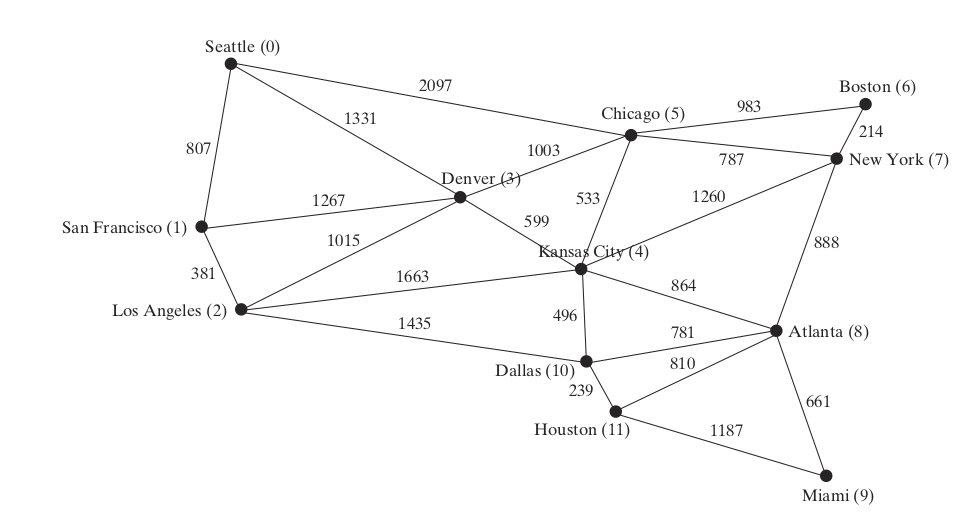{.stretch}

## Questions

1. How do you find the minimal total distances for connecting all cities?
2. How do you find the shortest path between two cities?

This chapter addresses these questions.

## Questions

1. How do you find the minimal total distances for connecting all cities? -- **Minimal Spanning Tree (MST)** problem
2. How do you find the shortest path between two cities? -- **Shortest Path Problem**

## Edge-Weighted vs. Vertex-Weighted

* There are two types of weighted graphs: vertex weighted and edge weighted.
* In a vertex-weighted graph, each vertex is assigned a weight.
* In an edge-weighted graph, each edge is assigned a weight.
* Of the two types, edge-weighted graphs have more applications.

# Representing Weighted Graphs

## Representing Weighted Graphs

* Weighted graphs can be represented in the same way as unweighted graphs, except that you have to represent the weights on the edges.
* As with unweighted graphs, the vertices in weighted graphs can be stored in an array.
* This section introduces three representations for the edges in weighted graphs.

## Edge Array

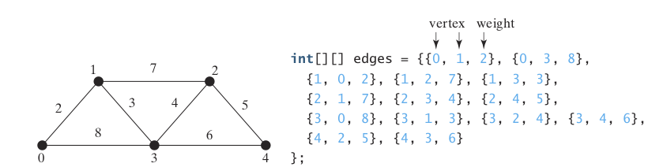{.stretch}


## Weighted Adjacency Matrix

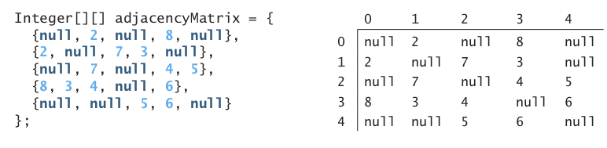{.stretch}

## Adjacency Lists

* Another way to represent the edges is to define edges as objects

## Adjacency Lists

```java
public class WeightedEdge extends AbstractGraph.Edge
    implements Comparable<WeightedEdge> {
  public double weight; // The weight on edge (u, v)

  /** Create a weighted edge on (u, v) */
  public WeightedEdge(int u, int v, double weight) {
    super(u, v);
    this.weight = weight;
  }
```
...

## Adjacency Lists

...
```java
  public int compareTo(WeightedEdge edge) {
    if (weight > edge.weight) {
      return 1;
    }
    else if (weight == edge.weight) {
      return 0;
    }
    else {
      return -1;
    }
  }
}
```

## Adjacency Lists

* These objects are then stored in some sort of list, like this:

```java
java.util.List<WeightedEdge>[] list = new java.util.List[5];
```

## Adjacency Lists

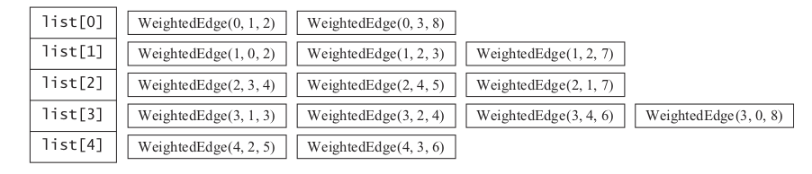{.stretch}

# The WeightedGraph Class

## WeightedGraph Class

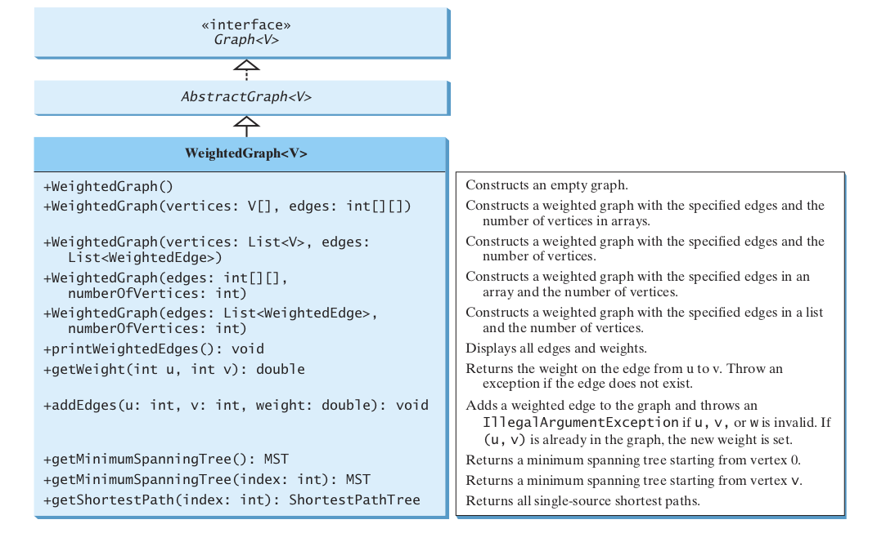{.stretch}

# Minimum Spanning Trees

## Key Term: Minimum Spanning Tree

> A minimum spanning tree of a graph is a spanning tree with the minimum total weights.

## Minimum Spanning Trees

* A graph may have many spanning trees.
* Suppose that the edges are weighted.
* A minimum spanning tree has the minimum total weights.

## Minimum Spanning Trees

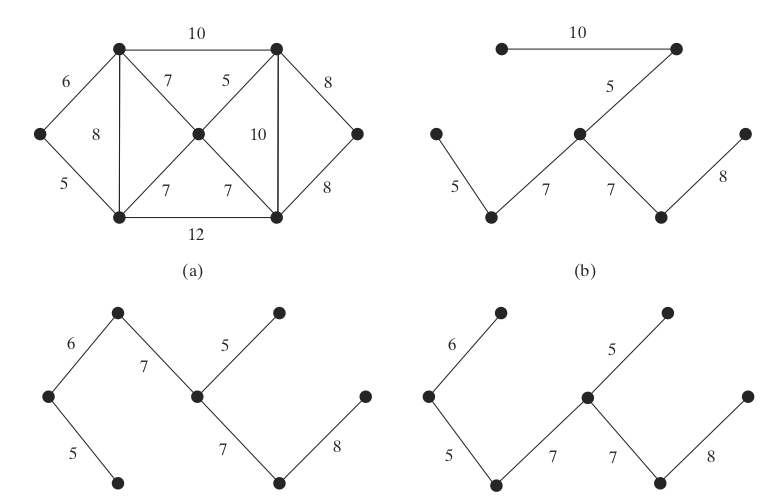{.stretch}

## Prim's Algorithm

* How do you find a minimum spanning tree?
* There are several well-known algorithms for doing so.
* This section introduces Prim’s algorithm.

## Prim's Algorithm

* Prim’s algorithm starts with a spanning tree T that contains an arbitrary vertex.
* The algorithm expands the tree by repeatedly adding a vertex with the lowest-cost edge incident to a vertex already in the tree.
* Prim’s algorithm is a _greedy algorithm_.

## Prim's MST

* Input: A connected undirected weighted G = (V, E) with non-negative weights
* Output: MST (a minimum spanning tree)

```
MST minimumSpanningTree() {
  Let T be a set for the vertices in the spanning tree;
  Initially, add the starting vertex to T;
  while (size of T < n) {
    Find u in T and v in V – T with the smallest weight on the edge (u, v)
    Add v to T and set parent[v] = u;
```

## Prim's MST

* Input: A connected undirected weighted G = (V, E) with non-negative weights
* Output: MST (a minimum spanning tree)

```
MST minimumSpanningTree() {
  Let T be a set for the vertices in the spanning tree;
  Initially, add the starting vertex to T;
  while (size of T < n) {
    Find u in T and v in V – T with the smallest weight on the edge (u, v)
    Add v to T and set parent[v] = u;
```

## Prim's MST

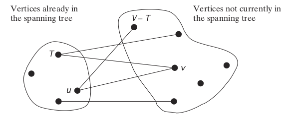{.stretch}

## Prim's MST

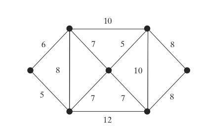{.stretch}

## Prim's MST

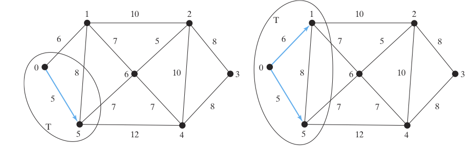{.stretch}

## Prim's MST

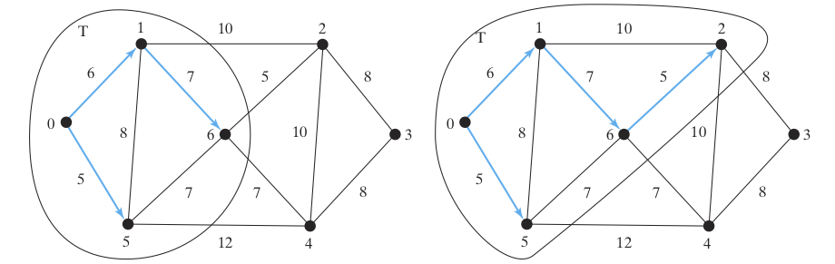{.stretch}

## Prim's MST

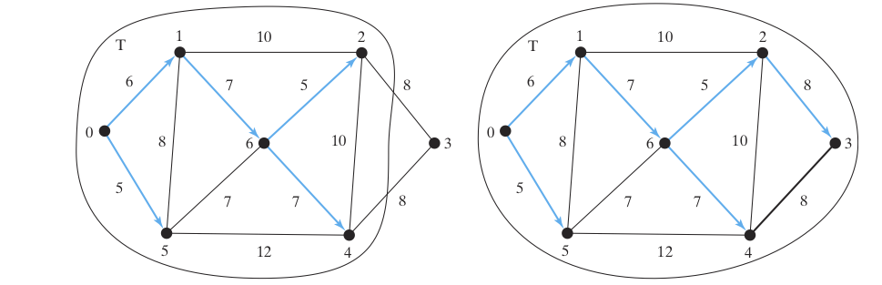{.stretch}

# Shortest Path

## Key Term: Shortest Path

> The shortest path between two vertices is a path with the minimum total weights.
