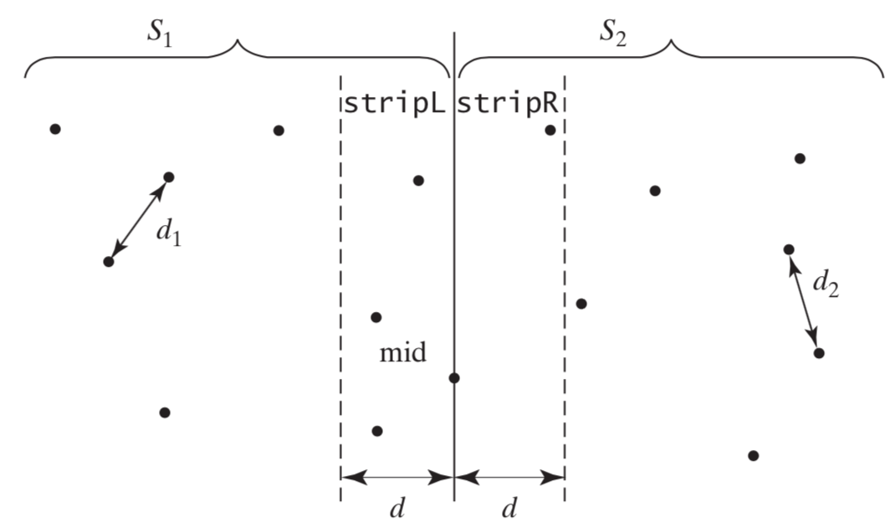
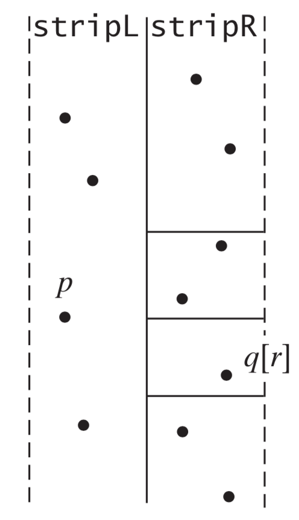
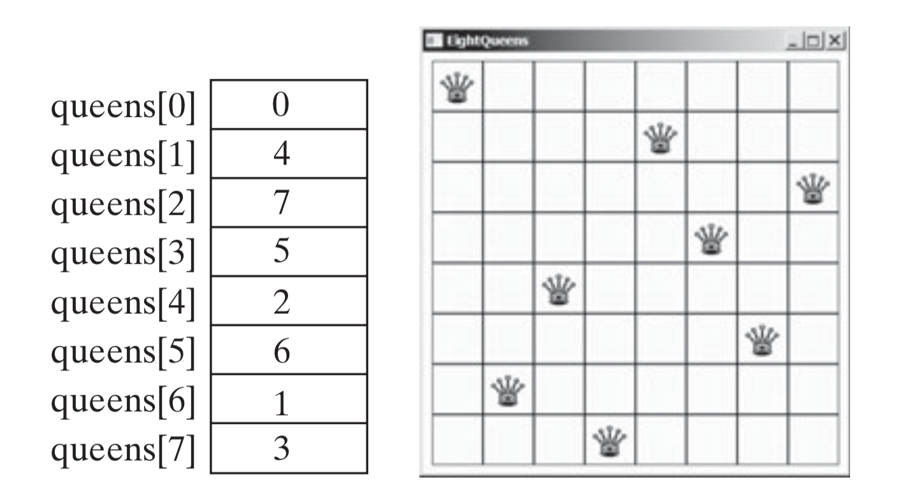

# Introduction (22.1)

## Objectives

* To estimate algorithm efficiency using the Big O notation (§22.2).
* To explain growth rates and why constants and nondominating terms
can be ignored in the estimation (§22.2).
* To determine the complexity of various types of algorithms (§22.3).
* To analyze the binary search algorithm (§22.4.1).
* To analyze the selection sort algorithm (§22.4.2).

## Objectives

* To analyze the Tower of Hanoi algorithm (§22.4.3).
* To describe common growth functions (constant, logarithmic, log- linear, quadratic, cubic, exponential) (§22.4.4).
* To design efficient algorithms for finding Fibonacci numbers using dynamic programming (§22.5).
* To find the GCD using Euclid’s algorithm (§22.6).
* To find prime numbers using the sieve of Eratosthenes (§22.7).


## Objectives

* To design efficient algorithms for finding the closest pair of points using the divide-and-conquer approach (§22.8).
* To solve the Eight Queens problem using the backtracking approach (§22.9).
* To design efficient algorithms for finding a convex hull for a set of points (§22.10).

## Introduction

* Algorithm design is to develop a mathematical process for solving a problem. Algorithm analysis is to predict the performance of an algorithm.
* This chapter will use a variety of examples to introduce common algorithmic techniques (dynamic programming, divide-and-conquer, and backtracking) for developing efficient algorithms
* Before introducing developing efficient algorithms, we need to address the question on how to measure algorithm efficiency.

# Measuring Efficiency (22.2)

## Big O Notation

* The Big O notation obtains a function for measuring algorithm time complexity based on the input size.
* You can ignore multiplicative constants and nondominating terms in the function.

## Comparing Search Algorithms

* Suppose two algorithms perform the same task, such as search (*linear search* vs. *binary search*).
* Which one is better?

## Measuring Runtime

* To answer this question, you might implement these algorithms and run the programs to get execution time. But there are two problems with this approach:
  - First, many tasks run concurrently on a computer. The execution time of a particular program depends on the *system load*.
  - Second, the execution time depends on *specific input*. Consider, for example, linear search and binary search. If an element to be searched happens to be the first in the list, linear search will find the element quicker than binary search.

## Growth Rates

* It is very difficult to compare algorithms by measuring their execution time.
* To overcome these problems, a theoretical approach was developed to analyze algorithms independent of computers and specific input.
* This approach approximates the effect of a change on the size of the input.
* In this way, you can see how fast an algorithm’s execution time increases as the input size increases, so you can compare two algorithms by examining their **growth rates**.

## Measuring Runtime

* For the same input size, an algorithm’s execution time may vary, depending on the input.
* An input that results in the shortest execution time is called the best-case input,
* An input that results in the longest execution time is the worst-case input.

## Measuring Runtime

* **Best-case analysis** and **worst-case analysis** are to analyze the algorithms for their best-case input and worst-case input.
* Best-case and worst-case analysis are not representative
* Worst-case analysis is very useful. You can be assured that the algorithm will never be slower than the worst case.

## Measuring Runtime

* An **average-case analysis** attempts to determine the average amount of time among all possible inputs of the same size.
* Average-case analysis is ideal, but difficult to perform, because for many problems it is hard to determine the relative probabilities and distributions of various input instances.
* Worst-case analysis is easier to perform, so the analysis is generally conducted for the worst case.


## Example: Linear Search

*  The linear search algorithm compares the key with the elements in the array sequentially until the key is found or the array is exhausted.
* If the key is not in the array, it requires n comparisons for an array of size n.
* If the key is in the array, it requires n/2 comparisons on average.
* The algorithm’s execution time is proportional to the size of the array.

## Example: Linear Search

*  If you double the size of the array, you will expect the number of comparisons to double.
* The algorithm grows at a linear rate. The growth rate has an order of magnitude of n.
* Computer scientists use the Big O notation to represent the “order of magnitude.”
* Using this notation, the complexity of the linear search algorithm is O(n), pronounced as “order of n.”

## Example: Linear Search

n\\f(n) | n   | n/2 | 100n   
-------|-----|-----|--------
100    | 100 | 50  | 10,000
200    | 200 | 100 | 20,000  

* f(n) = n, f(n) = n/2 and f(n) = 100n are all linear functions
* Doubling the size of n does yields the same growth rate for all three functions

## Example: Array Maximum

* Consider the algorithm for finding the maximum number in an array of n elements.
* To find the maximum number if n is 2, it takes one comparison;
* if n is 3, two comparisons.
* In general, it takes n - 1 comparisons to find the maximum number in a list of n elements.
* So what is the order of magnitude for this algorithm?  Hint: it's not O(n-1)

##  Example: Array Maximum

* Algorithm analysis is for large input size.
* If the input size is small, there is no significance in estimating an algorithm’s efficiency.
* As n grows larger, the n part in the expression n - 1 dominates the complexity.
* **The Big O notation allows you to ignore the nondominating part** (e.g., -1 in the expression n - 1) and **highlight the important part** (e.g., n in the expression n - 1).
* Therefore, the complexity of this algorithm is O(n).

## Constant Time

* If the time is not related to the input size, the algorithm is said to take constant time with the notation O(1).
* For example, a method that retrieves an element at a given index in an array takes *constant time*, because the time does not grow as the size of the array increases.

## Other Examples

* So far you have seen examples of:
  - O(n) "Linear"
  - O(1) "Constant time"
* There are other orders of magnitude

## Other Examples

$$1 + 2 + 3 + ... + (n-2) + (n-1) = \frac{n(n-1)}{2} = O(?)$$

## Other Examples

$$1 + 2 + 3 + ... + (n-2) + (n-1) = \frac{n(n-1)}{2} = O(n^2)$$

## Other Examples

$$1 + 2 + 3 + ... + (n-1) + (n) = \frac{n(n+1)}{2} = O(?)$$

## Other Examples

$$1 + 2 + 3 + ... + (n-1) + (n) = \frac{n(n+1)}{2} = O(n^2)$$

## Other Examples

$$a^0 + a^1 + a^2 + a^3 + ... + a^{n-1} + a^n  = \frac{a^{n+1} - 1}{a-1} = O(?)$$

## Other Examples

$$a^0 + a^1 + a^2 + a^3 + ... + a^{n-1} + a^n  = \frac{a^{n+1} - 1}{a-1} = O(a^n)$$


## Other Examples

$$2^0 + 2^1 + 2^2 + 2^3 + ... + 2^{n-1} + 2^n  = \frac{2^{n+1} - 1}{2-1} = O(?)$$

## Other Examples

$$2^0 + 2^1 + 2^2 + 2^3 + ... + a^{n-1} + 2^n  = \frac{2^{n+1} - 1}{2-1} = O(2^n)$$

## Orders of Magnitude Covered

* O(1) "Constant time"
* O(n) "Linear"
* O(n^2) "Quadratic"
* O(2^n) "Exponential"

## Two Complexity Measures

* *Time complexity* is a measure of execution time using the Big-O notation. Similarly, you can also measure space complexity using the Big-O notation.
* *Space complexity* measures the amount of memory space used by an algorithm.
  * The space complexity for most algorithms presented in the book is O(n). i.e., they exibit linear growth rate to the input size.
  * For example, the space complexity for linear search is O(n).

# Determining Big O (22.3)

## Big O Example 1

Consider the time complexity for the following loop:

```java
for (int i = 1; i <= n; i++) {
  k = k + 5;
}
```

## Big O Example 1

* The statement `k = k + 5;` is a constant time, *c*.  
* When it is put inside of the for loop, `for (int i = 1; i <= n; i++)`, the time complexity becomes:


T(n) = ( a constant _c_ ) * n = O(n)

## Big O Example 2

Consider the time complexity for the following loop:

```java
for (int i = 1; i <= n; i++) {
  for (int j = 1; j <= n; j++) {
    k = k + i + j;
  }
}
```

## Big O Example 2

* The statement `k = k + i + j;` is a constant time, *c*.  
* The inner loop runs j times
* The outer loop runs i times
* So how many total times does the addition statement run?

## Big O Example 2


The time complexity for this loop is:

T(n) = (a constant *c*) * n * n = O(n^2^)

* O(n^2^) is called a **quadratic algorithm**.  When input size is doubled, the time quadruples
* Nested loops often create quadratic Big O's

## Big O Example 3

Consider the time complexity for the following loop:

```java
for (int i = 1; i <= n; i++) {
  for (int j = 1; j <= i; j++) {
    k = k + i + j;
  }
}
```

## Big O Example 3

* The outer loop runs n times
* The inner loop is executed 1 time, then 2 times, then 3 times... up to n times.
* What is the time complexity?

## Big O Example 3

$$ \begin{aligned}T(n) &= c + 2c + 3c + 4c + ... + nc \\ &= cn (n+1)/2 \\ &= (c / 2) n^2 + (c / 2) n \\ &= O(n^2)
 \end{aligned} $$

## Big O Example 4

Consider the time complexity for the following loop:

```java
for (int i = 1; i <= n; i++) {
  for (int j = 1; j <= 20; j++) {
    k = k + i + j;
  }
}
```

## Big O Example 4

* The inner loop executes 20 times, and the outer loop n times.  Therefore, the time complexity for the loop is:

$$ \begin{aligned}T(n) &= 20*c*n \\ &= O(n)
 \end{aligned} $$


## Big O Example 5

 Consider the time complexity for the following loop:

 ```java
 for (int j = 1; j <= 10; j++) {
   k = k + 4;
 }
 for (int i = 1; i <= n; i++) {
   for (int j = 1; j <= 20; j++) {
     k = k + i + j;
   }
}
```

## Big O Example 5

* The first loop executes 10 times
* The second loop executes 20*n times
* What is the Big O for this code?

 $$ \begin{aligned}T(n) &= 10*c + 20*c*n \\ &= O(?)
  \end{aligned} $$

## Big O Example 5

* The first loop executes 10 times
* The second loop executes 20*n times
* What is the Big O for this code?

  $$ \begin{aligned}T(n) &= 10*c + 20*c*n \\ &= O(n)
   \end{aligned} $$


## Big O Example 6

```java
if (list.contains(e)) {     
  System.out.println(e);
}
else
  for (Object t: list) {
    System.out.println(t);
  }
```

* Suppose the list contains n elements
* The execution time for list.contains(e) is O(n)
* The loop in the else clause takes O(n) time.
* What is the time complexity for the entire statement?

## Big O Example 6

```java
if (list.contains(e)) {     
  System.out.println(e);
}
else
  for (Object t: list) {
    System.out.println(t);
  }
```

$$ \begin{aligned}T(n) &= if\ test\ time + worstcase\ test\ time \\ &= O(n) + O(n) \\ &= O(?)
 \end{aligned} $$

## Big O Example 6

```java
if (list.contains(e)) {     
 System.out.println(e);
}
else
 for (Object t: list) {
   System.out.println(t);
 }
```

$$ \begin{aligned}T(n) &= if\ test\ time + worstcase\ test\ time \\ &= O(n) + O(n) \\ &= O(n)
\end{aligned} $$

## Big O Example 7

```java
result = 1;
for (int i = 1; i <= n; i++)
  result *= a;
```

What is the execution time?

## Big O Example 7

```java
result = 1;
for (int i = 1; i <= n; i++)
  result *= a;
```

$$ O(n) $$

## Big O Example 7

```java
result = 1;
for (int i = 1; i <= n; i++)
  result *= a;
```

What if we knew that $n=2^k$ for some k?

## Big O Example 7

We could improve the algorithm like this:

```java
result = a;
for (int i = 1; i <= k; i++)
  result = result*result;
```

We don't know that $n=2^k$ for some k, but the algorithm can be revised to prove that the complexity is still O(log n) for the general case for n.

# Practice

## Practice 1: Count Iterations

```java
int count = 1;
while (count < 30) {
  count = count * 2;
}
```

## Practice 2: Count Iterations

```java
int count = 15;
while (count < 30) {
  count = count * 3;
}
```

## Practice 3: Count Stars

```java
for (int i = 0; i < n; i++) {
  System.out.print('*');
}
```

## Practice 4: Count Iterations

```java
for (int k = 0; k < n; k++) {
  for (int i = 0; i < n; i++) {
    for (int j = 0; j < n; j++) {
      System.out.print('*');
    }   
  }
}
```

## Practice 5: Time Complexity

```java
public static void mA(int n) {
  for (int i = 0; i < n; i++) {
    System.out.print(Math.random());
  }
}
```

## Practice 6: Time Complexity

```java
public static void mB(int n) {
  for (int i = 0; i < n; i++) {
    for (int j = 0; j < i; j++)
      System.out.print(Math.random());
  }
}
```

## Practice 7: Time Complexity

```java
public static void mC(int[ ] m) {
  for (int i = 0; i < m.length; i++) {
    System.out.print(m[i]);
  }
  for (int i = m.length - 1; i >= 0; ) {
    System.out.print(m[i]);
    i--;
  }
}
```

## Practice 8: Time Complexity

```java
public static void mD(int[] m) {
  for (int i = 0; i < m.length; i++) {
    for (int j = 0; j < i; j++)
      System.out.print(m[i] * m[j]);
  }
}
```

# Analyzing Complexity (22.4)

# Binary Search

This section analyzes the complexity of several well-known algorithms:

* binary search
* selection sort
* Tower of Hanoi.

## Binary Search

Remember binary search?

On a sorted array, we:

1. "Guess" that the middle element is our key.
2. If the middle element is greater or less than our key, repeat the search using the second or first half of the array, respectively
3. When you find the key, or our subarray reached zero length, stop.

## Binary Search

```java
public static int binarySearch(int[] list, int key) {
  int low = 0;
  int high = list.length - 1;
  while (high >= low) {
    int mid = (low + high) / 2;
    if (key < list[mid])
      high = mid - 1;
    else if (key == list[mid])
      return mid;
    else
      low = mid + 1;
  }
  return -low - 1; // Now high < low
}
```

## Binary Search

* Each iteration in the algorithm contains a fixed number of operations, denoted by c.
* Let T(n) denote the time complexity for a binary search on a list of n elements.
* Without loss of generality, assume n is a power of 2 and k = log n.

## Binary Search

* Since a binary search eliminates half of the input after two comparisons:

$$ \begin{aligned}T\Big(n\Big) &= T  \Big(\frac{n}{2}\Big) + c = T\Big(\frac{n}{2^2}\Big) + c + c = T\Big(\frac{n}{2^k}\Big) + kc \\ &= T\Big(1\Big) + c\ log\ n =1 + (log\ n) c \\ &= O(log\ n) \end{aligned} $$

# Selection Sort

## Selection Sort Algorithm

1. Find the smallest element in the list and swaps it with the first element.
2. Find the smallest element remaining and swaps it with the first element in the remaning list
3. Repeat until only one element is left.

## Selection Sort Analysis

* The number of comparisons is n - 1 for the first iteration, n - 2 for the second iteration, and so on.
* Let T(n) denote the complexity for selection sort
* Let c denote the total number of other operations such as assignments and additional comparisons in each iteration.
* What is Big O for Selection Sort?

## Selection Sort Analysis

$$ \begin{aligned} T(n) &= (n - 1) + c + (n - 2) + c + ... + 2 + c + 1 + c \\
&= \frac{(n - 1)(n - 1 + 1)}{2} + c(n-1) = \frac{n^2}{2} - \frac{n}{2} +cn-c \\
&= O(?) \end{aligned} $$


## Selection Sort Analysis

$$ \begin{aligned} T(n) &= (n - 1) + c + (n - 2) + c + ... + 2 + c + 1 + c \\
&= \frac{(n - 1)(n - 1 + 1)}{2} + c(n-1) = \frac{n^2}{2} - \frac{n}{2} +cn-c \\
&= O(n^2) \end{aligned} $$

The complexity of the selection sort algorithm is **O(n^2^)**.

# Tower of Hanoi

## Tower of Hanoi Algorithm

1. Move the first n - 1 disks from A to C with the assistance of tower B.
2. Move disk n from A to B.
3. Move n - 1 disks from C to B with the assistance of tower A.

## Tower of Hanoi Analysis

* The complexity of this algorithm is measured by the number of moves.
* Let T(n) denote the number of moves for the algorithm to move n disks from tower A to tower B with $T(1) = 1.$
* What is the time complexity of the Tower of Hanoi algorithm?

## Tower of Hanoi Analysis

$$ \begin{aligned} T(n) &= T(n-1) + 1 + T(n-1) \\
 \end{aligned} $$

## Tower of Hanoi Analysis

$$ \begin{aligned} T(n) &= T(n-1) + 1 + T(n-1) \\
&=2T(n-1) + 1 \\
\end{aligned} $$

## Tower of Hanoi Analysis

$$ \begin{aligned} T(n) &= T(n-1) + 1 + T(n-1) \\
&=2T(n-1) + 1 \\
&= 2(2T(n-2)+1)+1\\
 \end{aligned} $$

## Tower of Hanoi Analysis

$$ \begin{aligned} T(n) &= T(n-1) + 1 + T(n-1) \\
&=2T(n-1) + 1 \\
&= 2(2T(n-2)+1)+1\\
&= 2(2(2T(n-3) + 1)+1)+1 \\
 \end{aligned} $$

## Tower of Hanoi Analysis

$$ \begin{aligned} T(n) &= T(n-1) + 1 + T(n-1) \\
&=2T(n-1) + 1 \\
&= 2(2T(n-2)+1)+1\\
&= 2(2(2T(n-3) + 1)+1)+1 \\
&= 2^{n-1} T(1)  + 2^{n-2} + ... + 2 + 1 \\
\end{aligned} $$

## Tower of Hanoi Analysis

$$ \begin{aligned} T(n) &= T(n-1) + 1 + T(n-1) \\
&=2T(n-1) + 1 \\
&= 2(2T(n-2)+1)+1\\
&= 2(2(2T(n-3) + 1)+1)+1 \\
&= 2^{n-1} T(1)  + 2^{n-2} + ... + 2 + 1 \\
&= 2^{n-1} + 2^{n-2} + ... + 2 + 1 = (2^n -1 ) \\
&= O(?)
\end{aligned} $$

## Tower of Hanoi Analysis

$$ \begin{aligned} T(n) &= T(n-1) + 1 + T(n-1) \\
&=2T(n-1) + 1 \\
&= 2(2T(n-2)+1)+1\\
&= 2(2(2T(n-3) + 1)+1)+1 \\
&= 2^{n-1} T(1)  + 2^{n-2} + ... + 2 + 1 \\
&= 2^{n-1} + 2^{n-2} + ... + 2 + 1 = (2^n -1 ) \\
&= O(2^n)
\end{aligned} $$

The Big O of Tower of Hanoi is **O(2^n^)**.

## Tower of Hanoi Analysis

* An algorithm with O(2^n^) time complexity is called an exponential algorithm, and it exhibits an exponential growth rate.
* As the input size increases, the time for the exponential algorithm grows exponentially.

## Exponential Algorithms

* Exponential algorithms are not practical for large input size.
* Suppose the disk is moved at a rate of 1 per second.
* It would take 232/(365 * 24 * 60 * 60) = 136 years to move 32 disks
* It would take 264/(365 * 24 * 60 * 60) = 585 billion years to move 64 disks.

## Recurrence Relations {.tinyslide }

Recurrence Relation               | Result            | Example
----------------------------------|-------------------|------------------------------
$T(n) = T(n/2) + O(1)$              | $T(n) = O(log\ n)$   | Binary search, Euclid’s GCD
$T(n) = T(n - 1) + O(1)$            | $T(n) = O(n)$       | Linear search
$T(n) = 2T(n/2) + O(1)$             | $T(n) = O(n)$       | Checkpoint Question 22.20
$T(n) = 2T(n/2) + O(n)$             | $T(n) = O(n\ log\ n)$ | Merge sort (Chapter 23)
$T(n) = T(n - 1) + O(n)$            | $T(n) = O(n^2)$    | Selection sort
$T(n) = 2T(n - 1) + O(1)$           | $T(n) = O(2^n)$    | Tower of Hanoi
$T(n) = T(n - 1) + T(n - 2) + O(1)$ | $T(n) = O( 2^n )$    | Recursive Fibonacci algorithm

## Comparing Common Growth Rates {.tinyslide }

Function  | Name | n=25 | n=50 | f(50)/f(25)
--|--|--|--|--
O(1) | Constant time | 1 | 1 | 1
O(log n) | Logarithmic time | 4.64 | 5.64 | 1.21
O(n) | Linear time | 25 | 50 | 2
O(n log n) | Log-linear time | 116 | 282 | 2.43
O(n^2^) | Quadratic time | 625 | 2,500 | 4
O(n^3^) | Cubic time | 15,625 | 125,000 | 8
O(2^n^) | Exponential time | 3.36 * 10^7^ | 1.27 * 10^15^ | 3.35 * 10^7^

## Comparing Growth Rates

O(1) < O(log n) < O(n) < O(n log n)

< O(n^2^) < O(n^3^) < O(2^n^)

## Comparing Growth Rates

{.stretch}

## Comparing Growth Rates

{width=700}

# Fibonacci Using Dynamic Programming (22.5)

## Recursive Fibonacci

```java
/** The method for finding the Fibonacci number */
public static long fib(long index) {
  if (index == 0) // Base case
    return 0;
  else if (index == 1) // Base case
    return 1;
  else // Reduction and recursive calls
    return fib(index - 1) + fib(index - 2);
}
```

## Recursive Fibonacci

* We can now prove that the complexity of this algorithm is O(2^n^).
* For convenience, let the index be n.
* Let T(n) denote the complexity for the algorithm that finds fib(n)
* Let c denote the constant time for comparing the index with 0 and 1;
* That is, T(1) and T(0) are c.

## Recursive Fibonacci

$$ \begin{aligned} T(n) &= T(n - 1) + T(n - 2) + c \\
&\leq 2T(n-1)+c \\
&\leq 2(2T(n-2)+c)+c \\
&= 2^2 T(n - 2) + 2c + c \\
&= O(?)\end{aligned}$$

## Recursive Fibonacci

$$ \begin{aligned} T(n) &= T(n - 1) + T(n - 2) + c \\
&\leq 2T(n-1)+c \\
&\leq 2(2T(n-2)+c)+c \\
&= 2^2 T(n - 2) + 2c + c \\
&= O(2^n)\end{aligned}$$

## Recursive Fibonacci

* O(2^n^) this algorithm is not efficient.
* What makes this algorithm so inefficient?

## Recursive Fibonacci

> * O(2^n^) this algorithm is not efficient.
> * What makes this algorithm so inefficient?
> * It is inefficient because it makes redundant calculations
> * $fib(4) = fib(3) + fib(2)$
> * $fib(3) = fib (2) + fib(1)$
> * ...
> * What if we saved fib(2) instead of calculating it twice?

# Improved Fibonacci (22.5)

## Improved Fibonacci

```java
  public static long fib(long n) {   
    long f0 = 0; // For fib(0)
    long f1 = 1; // For fib(1)
    long f2 = 1; // For fib(2)
    if (n == 0)
      return f0;
    else if (n == 1)
      return f1;
    else if (n == 2)
      return f2;
    ...
```

## Improved Fibonacci O(?)

```java
    ...
    for (int i = 3; i <= n; i++) {
      f0 = f1;
      f1 = f2;
      f2 = f0 + f1;
    }  
    return f2;
  }
```

## Improved Fibonacci Analysis

This improved Fibonacci algorithm is $O(n)$

# Greatest Common Divisors (22.6)

## Greatest Common Divisors

* In algebra we seek to find the Greatest Common Divisors (GCD)
* For example, the GCD of 12 and 8 is 4
* There are different solutions for GCD.  
* For this exercise, m and n are our inputs and we assume $m \geq n$.

## Brute Force Methods

* **Brute force** refers to an algorithmic approach that solves a problem in the simplest or most direct or obvious way.
* As a result, such an algorithm can end up doing far more work to solve a given problem than a cleverer or more sophisticated algorithm might do.
* On the other hand, a brute-force algorithm is often easier to implement than a more sophisticated one and, because of this simplicity, sometimes it can be more efficient.

## GCD Brute Force

* Given integers *m* and *n*, check every element from 2 up to the larger of *m* and *n* to see if it is a divisor of both
* Return the GCD

## GCD 1: Brute Force O(?)

```java
public static int gcd(int m, int n) {
  int gcd = 1;
  for (int k = 2; k <= m && k <= n; k++) {
    if (m % k == 0 && n % k == 0)
      gcd = k;
  }
  return gcd;
}
```

## GCD 1: Brute Force

> * $O(n)$
> * How could we improve it?
> * What if we checked from the top down instead of bottom up?

## GCD 2 O(?)


```java
for (int k = n; k >= 1; k--) {
  if (m % k == 0 && n % k == 0) {
    gcd = k;
    break;
  }
}
```

## GCD 2

> * Better than GCD Brute Force 1
> * What is the time complexity?
> * Worst case is still $O(n)$
> * Observation: a divisor cannot by more than half of a number.  So we can begin our search there instead of at n.

## GCD 3 O(?)

```java
for (int k = m / 2; k >= 1; k--) {
  if (m % k == 0 && n % k == 0) {
    gcd = k;
    break;
  }
}
```

## GCD 3

> * Oops, this algorithm is faster but incorrect
> * It doesn't consider than *n* can be a divisor for *m*

## GCD 4 O(?)

```java
public static int gcd(int m, int n) {
  int gcd = 1;
  if (m % n == 0) return n;
  for (int k = n / 2; k >= 1; k--) {
    if (m % k == 0 && n % k == 0) {
      gcd = k;
      break;
    }
  }
  return gcd;
}
```

## GCD 4

> * Assuming m $\geq$ n, the for loop is executed at most n/2 times
> * This cuts the time in half from the previous algorithm
> * T time complexity is still $O(n)$, but practically, it is much faster than GCD 2

## Euclid

* Euclid was a Greek Mathematician
* the "father of geometry"
* Born around 300 B.C.
* Invented a solution to Greatest Common Divisor

## Euclid's GCD

```java
public static int gcd(int m, int n) {
  if (m % n == 0)
    return n;
  else
    return gcd(n, m % n);
}
```

## Euclid's GCD Analysis

> * Best case is when $m \% n = 0 : O(n)$
> * Average case is hard to determine
> * What about worst case?

## Euclid's GCD Analysis

* If $n \leq m / 2, m \% n < m / 2$ since the remainder of m divided by n is always
less than n.
* If $n \gt m / 2, m \% n = m – n \lt m / 2$.
* Therefore $m \% n < m/2$
* Let's follow the recursive calls

## Euclid's GCD Analysis

> * $gcd(m, n)$
> * $gcd(n, m \% n)$
> * $gcd(m \% n, n \% (m \% n))$
> * ...

## Euclid's GCD Analysis

> * Since $m % n < m / 2$ and $n % (m % n) < n / 2$ ,the argument passed to the gcd method is reduced by half after every two iterations.
> * After invoking gcd two times, the second parameter is less than n/2.
> * After invoking gcd four times, the second parameter is less than
n/4.

## Euclid's GCD Analysis

* After invoking gcd six times, the second parameter is less than $\frac{n}{2^3}$.
* Let k be the number of times gcd is invoked
* After invoking gcd k times, the second parameter is less than ______

## Euclid's GCD Analysis

> * After invoking gcd k times, the second parameter is less than $\frac{n}{2^{k/2}}$ which is greater than or equal to 1:
> * $\frac{n}{2^{k/2}} \geq 1   => n \geq 2^{k/2} => k \leq 2 \log n$
> * Therefore, $k \leq 2\log n$
> * So the time complexity of Euclid's GCD is:
> * $O(\log n)$

## GCD Algorithm Analyis

Code Listing | Complexity | Description
--|--|--
GCD 1 | O(n) | Brute-force, checking all possible divisors
GCD 2  | O(n)  | Checking half of all possible divisors
Euclid's GCD  | O(log n)  | Euclid’s algorithm

# Prime Numbers (22.7)

## Prime Numbers

* Can you design a fast algorithm for finding prime numbers?
* An integer greater than 1 is prime if its only positive divisor is 1 or itself.
* For example, 2, 3, 5, and 7 are prime numbers
* 4, 6, 8, and 9 are not prime

## Prime #'s' Algorithms

> 1. Check $2, 3, 4, 5, ... n - 1$ to see if it is divisible by n O(n)
> 2. Check $2, 4, 5, 5 ... n/2$ to see if they are divisible by n: O(n)
> 3. It can be proven that if n is not prime, it must have a divisor $\leq \sqrt{n}$

## Prime #'s Algorithms

> * Since n is not prime, there exists two numbers p and q such that $n = pq\ such\ that\ 1 < p <= q$.
> * Note that $n = \sqrt{n}\sqrt{n}$.  
> * p must be less than or equal to $\sqrt{n}$.  
> * Hence, you only need to check whether $2, 3, 4, 5 ..., or \sqrt{n}$ is divisible by n.  If not, n is prime.  
> * This significantly reduces the time complexity of the algorithm to $O(\sqrt{n})$

# Prime #'s Demo

## Prime #'s Algorithms

* It has been proved that the number of prime numbers less than or equal to i is approximately $\frac{i}{\log i}$
* The time complexity of this algorithm is $O(\frac{n\sqrt{n}}{\log n})$

## Sieve of Eratosthenes

* Eratosthenes was a Greek mathematician
* He devised an algorithm called the Sieve of Eratosthenes to calculate all prime numbers $\leq n$
* It involves creating an array of boolean values and marking all numbers which are not divisors for n
* Review section 22.7 for implementation details

## Comparisons of Prime # Algorithms

Complexity                    | Description
------------------------------|--------------------------------------------
$O(n^2)$                      | Brute-Force, checking all possible divisors
$O(n\sqrt{n})$                | Checking divisors up to $\sqrt{n}$
$O(\frac{n\sqrt{n}}{\log n})$ | Checking prime numbers up to $\sqrt{n}$
$O(\frac{n\sqrt{n}}{\log n})$ | Sieve of Eratosthenes

# Finding Closest Points (22.8)

## Finding Closest points

* This sections presents efficient algorithms for finding the closest pair of points using divide-and-conquer
* [This animation illustrates the problem.](https://liveexample.pearsoncmg.com/liang/animation/web/ClosestPair.html)


## Divide and Conquer

* We will use an approach called divide-and-conquer to solve this problem.
* The approach divides the problem into subproblems, solves the subproblems, then combines the solutions of the subproblems to obtain the solution for the entire problem.
* Unlike the dynamic programming approach, the subproblems in the divide-and-conquer approach don’t overlap.

## Divide and Conquer

* A sub-problem is like the original problem with a smaller size, so you can apply recursion to solve the problem.
* In fact, all the solutions for recursive problems follow the divide-and-conquer approach.

## Closest Pair Algorithm

### 3 Step Algorithm

1. Sort the points in increasing order of x-coordinates. For the points with the same x-coordinates, sort on y-coordinates. This results in a sorted list S of points.
2. Divide S into two subsets, S~1~ and S~2~, of equal size using the midpoint in the sorted list. Let the midpoint be in S~1~. Recursively find the closest pair in S~1~ and S~2~. Let d~1~ and d~2~ denote the distance of the closest pairs in the two subsets, respectively.

## Closest Pair Algorithm

### 3 Step Algorithm

3. Find the closest pair between a point in S~1~ and a point in S~2~ and denote their distance as d~3~. The closest pair is the one with the distance min(d~1~, d~2~, d~3~).

## Closest Pair Algorithm

### Step 1

* _Step 1: Sort the points in increasing order of x-coordinates. For the points with the same x-coordinates, sort on y-coordinates. This results in a sorted list S of points._
* What is O(?) for Step 1?
* Selection sort takes $O(n^2)$.  
* In chapter 23 we will introduce merge sort and heap sort which are $O(n\log n)$

## Closest Pair Algorithm

### Step 3

* _Step 3: Find the closest pair between a point in S~1~ and a point in S~2~ and denote their distance as d~3~. The closest pair is the one with the distance min(d~1~, d~2~, d~3~)._
* What is O(?) for Step 3?
* Step 3 is $O(n)$.  

## Closest Pair Algorithm



## Closest Pair Algorithm

### Step 3

* Let d = min(d1, d2).
* We already know that the closest- pair distance cannot be larger than d. * For a point in S~1~ and a point in S~2~ to form the closest pair in S, the left point must be in stripL and the right point in stripR

## Closest Pair Algorithm

### Step 3

{.stretch}

## Closest Pair Algorithm

### Step 3

* For a point p in stripL, you need only consider a right point within the d * 2d rectangle, as shown below:

{.stretch}

## Closest Pair Algorithm

### Step 3

* Any right point outside the rectangle cannot form the closest pair with p.
* Since the closest-pair distance in S~2~ is greater than or equal to d, there can be at most six points in the rectangle.
* Thus, for each point in stripL, at most six points in stripR need to be considered.

## Closest Pair Algorithm

### Step 3

* For each point p in stripL, how do you locate the points in the corresponding d * 2d rectangle area in stripR?
* This can be done efficiently if the points in stripL and stripR are sorted in increasing order of their y-coordinates.

## Closest Pair Algorithm

### Step 3

* Let _pointsOrderedOnY_ be the list of the points sorted in increasing order of y-coordinates. _pointsOrderedOnY_ can be obtained beforehand in the algorithm.
* stripL and stripR can be obtained from pointsOrderedOnY

## Closest Pair Algorithm

### Partial Step 3

```java
for each point p in pointsOrderedOnY
  if (p is in S1 and mid.x – p.x <= d)
    append p to stripL;
else if (p is in S2 and p.x - mid.x <= d)
  append p to stripR;
```

## Closest Pair Algorithm

### Partial Step 3

```java
d = min(d1, d2);
r = 0; // r is the index of a point in stripR
for (each point p in stripL) {
// Skip the points in stripR below p.y - d
  while (r < stripR.length && q[r].y <= p.y - d)
    r++;
  let r1 = r;
  while (r1 < stripR.length && |q[r1].y – p.y| <= d) {
    // Check if (p, q[r1]) is a possible closest pair
    if (distance(p, q[r1]) < d) {
      d = distance(p, q[r1]);  
    }
    r1 = r1 + 1;
  }
}
```

## Closest Pair Algorithm

* The points in stripL are considered from p~0~, p~1~, ... , p~k~ in this order.
* For a point p in stripL, skip the points in stripR that are below p.y – d (lines 5–6).  
* Once a point is skipped, it will no longer be considered.
* The while loop (lines 9–17) checks whether (p, q[r1]) is a possible closest pair.
* There are at most six such q[r~1~] pairs, because the distance between two points in stripR cannot be less than d.
* So the complexity for finding the closest pair in Step 3 is O(n).

## Closest Pair Algorithm

* Note that Step 1 in Listing 22.8 is performed only once to presort the points.
* Assume that all the points are presorted.
* Let T(n) denote the time complexity for this algorithm.
* Thus, $T(n) = 2T(n/2) + O(n) = O(n \log n)$
Therefore, the closest pair of points can be found in O(n log n) time.
* [Video Explanation](https://www.youtube.com/watch?v=0W_m46Q4qMc)

# 8 Queens (22.9)

## 8 Queens

* The Eight Queens problem is to find a solution to place a queen in each row on a chessboard such that no two queens can attack each other.
* The problem can be solved using recursion (See Programming Exercise 18.34).
* In this section, we will introduce a common algorithm design technique called **backtracking** for solving this problem.
* The backtracking approach searches for a candidate solution incrementally, abandoning that option as soon as it determines that the candidate cannot possibly be a valid solution, and then looks for a new candidate
* [Demo](http://eightqueen.becher-sundstroem.de/)

## 8 Queens



## 8 Queens

The search starts from the first row with k = 0, where k is the index of the current row being considered. The algorithm checks whether a queen can be possibly placed in the jth column in the row for j = 0, 1, ... , 7, in this order. The search is implemented as follows:

* If successful, it continues to search for a placement for a queen in the next row. If the current row is the last row, a solution is found.
* If not successful, it backtracks to the previous row and continues to search for a new placement in the next column in the previous row.
* If the algorithm backtracks to the first row and cannot find a new placement for a queen in this row, no solution can be found.

## 8 Queens Demo


# Convex Hull (22.10)

* [Animation](https://liveexample.pearsoncmg.com/liang/animation/web/ConvexHull.html)
