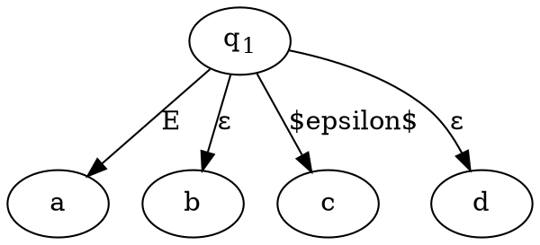

# Something else

```dot
digraph G{
    q_0 [label=<q<SUB>1</SUB>>]    
    q_0 -> a [label="E"]
    q_0 -> b [label="\&epsilon;"]
    q_0 -> c [label="$\epsilon$"]
    q_0 -> d [label="&#949;"]
}
```