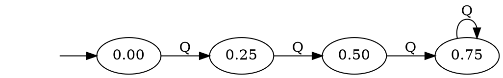
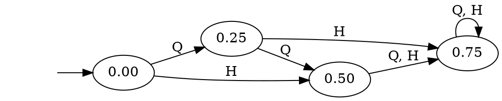
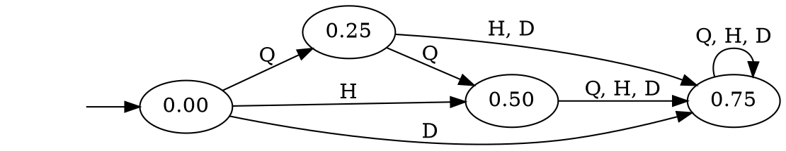
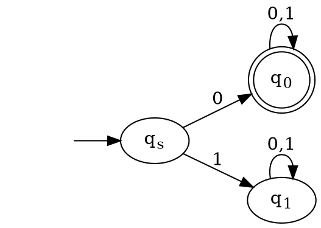

# Course Information

# Essentials

* Formal Language & Automata Theory (FLAT)
* Course Website - [atu-se.github.io/courses/flat](https://atu-se.github.io/courses/flat/)
* Primary Textbook - Introduction to the Theory of Computation, 3rd Edition (Sipser)]
* Lectures built around [UC San Diego Lectures](https://cseweb.ucsd.edu/classes/fa08/cse105)

# Meeting Times

# How to Succeed

* Attend all lectures
* Take notes (not all materials will be distributed as slides)
* Ready and study your textbook
* Do all assignments
* Ask questions
* Work many practice problems

# Academic Integrity

* Read the academic integrity policy in the syllabus
* You are encouraged to discuss the topics among yourselves.
* Unless otherwise noted, your work should be your own and you should not share your work with others
* Copying or cheating on homework, exams, etc. may result in failing grades

# Finite Automata

# Introduction

Computer Science stems from two starting points:

* Mathematics -- What can be be computed? (And what _cannot_ be computed?)
* Electrical Engineering -- How can we build computers?

This course focuses on the first question

# Introduction

* Computability Theory deals with the mathematical basis for Computer Science, yet it has some interesting practical ramifications
that I will try to point out sometimes.
* The questions we will try to answer in this course are:
    * What can be computed? 
    * What cannot be computed
    * Where is the line between the two?”

# Practical Application

* Some areas of practical application include:
    * compiler design
    * natural language processing
    * static code analysis
    * IDE development (syntax highlighting)
    * cryptography
    * genetic research

# Computational Models

* A Computational Model is a mathematical object (defined on paper) that enables us to reason about computation and to study the properties and limitations of computing.
* We will deal with three principal computational models in increasing order of Computational Power.

# Computational Models

* We will deal with three principal models of computations:
    1. Finite Automaton (FA) -- recognizes Regular Languages
    2. Push-down Automaton -- recognizes Context Free Languages
    3. Turing Machine (TM) -- recognizes Computable Languages 

# Alan Turing - A Short Detour

Dr. Alan Turing is one of the founders of Computer Science (he was an English Mathematician)

1. “Invented” Turing machines.
2. “Invented” the Turing Test.
3. Broke the German submarine transmission coding machine “Enigma”.
4. The movie Imitation Game is loosely based on his life.

# Finite Automaton Example

# Washing Machine

* The control of a washing machine is a very simple example of a finite automaton.
* The most simple washing machine accepts quarters and operation does not start until at least 3 quarters were inserted.
* Credit: Vadim Lyubasehvsky

# Coins

Washing machines take coins.  Our machine costs $0.75 to operate.  We will use this notation:

* Q = Quarter (0.25)
* H = Half-dollar (0.50)
* D = Dollar (1)

# Washing Machine 1

* Accepts Three Quarters
* Put in three (or more quarters) -- it begins operation
* Put in less -- it does nothing

# Washing Machine 1 

# Washing Machine 2

* Now imagine we have a more advanced machine which can accept both quarters (Q) and half-dollars (H).  
* How does the automata change?

# Washing Machine 2

Modify Washing Machine 1:

# Washing Machine 2

Result: 

# Washing Machine 3

* Now imagine we have a more advanced machine which can accept quarters (Q), and half-dollars (H), and dollars (D).  
* How does the automata change?

# Washing Machine 3

Modify Washing Machine 2:

# Washing Machine 3

Result:

#

# FA Example

$M_1:$

* States:  $\{ q_s, q_0, q_1\}$
* Initial State: $q_s$
* Final/Final States: $\{q_0\}$

# FA Example

* $M_1$ Transition Function: 
    * $\delta(q_s, 0) = q_0$
    * $\delta(q_s, 1) = q_1$
    * $\delta(q_0, 0) = \delta(q_0, 1) = q_0$
    * $\delta(q_1, 0) = \delta(q_1, 1) = q_1$

# Finite Automaton Example

$M_1:$

* Alphabet: $\{ 0, 1\}$
* Accepted Words: $\{0, 00, 01, 000, 001, ...\}$

# FA - Formal Definition

A finite automaton is a 5-tuple $(Q,\Sigma,\delta,q_0 ,F)$

1. Q is a finite set called the *states*.
2. $\Sigma$ is a finite set called the *alphabet*.
3. $\delta: Q \times \Sigma \rightarrow Q$ is the *transition function*.
4. $q_0 \in Q$ is the *start state*, and
5. $F \subseteq Q$ ,is the set of *accept states*.

# FA - Formal Definition

* Don't get lost in the notation.
* More important than the notation is to understand the concepts
* Notation allows us to communicate clearly
    * $\Sigma$ = "Sigma"
    * $\delta$ = "Delta"

# Observations

1. Each state has *a single transition* for each symbol in the alphabet
2. Every FA has a computation for *every finite string* over the alphabet

# Examples

$M_2$ accepts all words (strings) ending with 1 over the alphabet $\{0,1\}$.

The language recognized by $M_2$ called $L(M_2)$ satisfies:
$$ L(M_2) = \{w | w\ ends\ with\ a\ 1\} $$

# How to Do It

1. Find some simple examples (short accepted and rejected words)
2. Think what each state should "remember" or represent
3. Draw the states with a meaningful name
4. Draw transitions that preserve the states' "memory"
5. Validate or correct
6. Write a correctness argument

# Exercises

1. $M_3$ accepts all words (strings) beginning with 1.
    $L(M_3) = \{w | w\ ends\ with\ 1\}$
2. $M_4$ accepts all words ending with 0.
3. $M_5$ accepts all words not ending with 0, including $\epsilon$
    * You can accept an $\epsilon$ by accepting the start state
    * $M_5$ is the *complement automaton* of $M_4$

# Exercises

4. $M_6$ accepts all string *over alphabet* $\{a, b\}$ that _start and end_ with the same *symbol*.
5. $M_7$ accepts words of the form $0^m1^n$ where $m, n$ are integers and $m, n > 0$
6. $M_8$ accepts all words in $\{0, 1, 00, 01, 10\}$

# Wrap Up

* During this lecture we:
    * Gave some motivation for the course
    * Introduced the idea of computational models
    * Introduced and defined the first computational model, the finite automaton

# References, Resources

* [ADUni.org Lectures](https://www.youtube.com/playlist?list=PL601FC994BDD963E4)
* [UC San Diego Lecture Slides](https://cseweb.ucsd.edu/classes/fa08/cse105/)