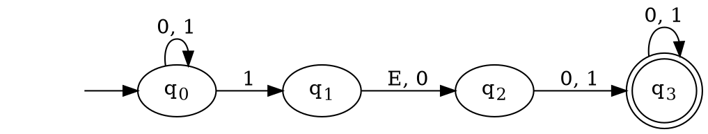
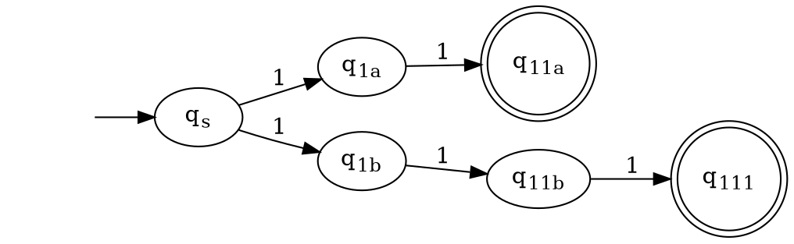
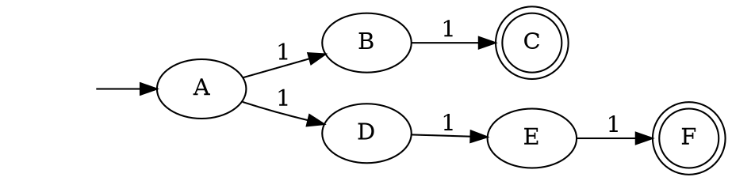
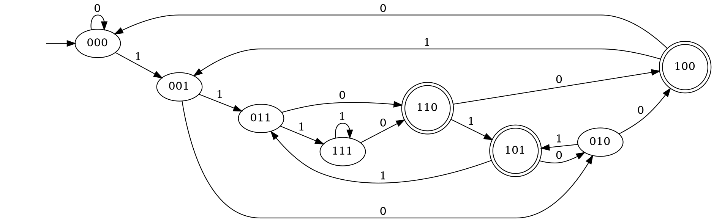
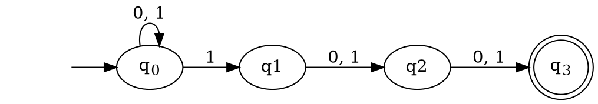

# Roadmap for Lecture 

* Present the three regular operations.
* Present Non-Deterministic Finite Automata (NFA)
* Prove that NFAs and DFAs are equivalent.
* Use NFAs to show that when each of the regular operation is applied on regular languages it yields yet another regular language.

# Regular Operations 

* Let A and B be 2 regular languages over the same alphabet, $\Sigma$.  We define the 3 regular operations:
    * Union: $A \cup B = \{ x | x \in A\ or\ x \in B\}$
    * Concatenation: $A \circ B = \{ xy | x \in A\ and\ y \in B\}$
    * Star: $A^* = \{ x_1, x_2, ..., x_k | k \geq 0\ and\ x_k \in A\}$

# Elaboration 

* Union is straight forward.
* Concatenation is the operation in which each word in A is concatenated with every word in B.
* Star is a unary operation in which each word in A is concatenated with every other word in A and this happens any finite number of times.

# Regular Operations

* $A = \{good, bad \}$
* $B = \{girl, boy\}$
* $A \cup B =\{good, bad, girl, boy\}$
* $A \circ B = \{goodgirl, goodboy,badgirl,badboy\}$
* $A^* = \{ \epsilon , good , bad , goodgood , goodbad, goodgoodgoodbad, badbadgoodbad,...\}$

# Motivation for Nondeterminism

* The Regular Operations give us a way to construct all regular languages systematically.
* In the previous lecture, we showed that the union operation preserves regularity:
* Given two regular languages L~1~ and L~2~ and their recognizing automata, M~1~ and M~2~, we constructed an automaton that recognizes $L_1 \cup L_2$

# Motivation for Nondeterminism

* This approach fails when trying to prove that **concatenation**  and **star** preserve regularity.
* To overcome this problem we introduce **nondeterminism**.
* All of the FAs that we have discussed so far have been deterministic finite automata (DFAs)
* We now introduce the idea of a non-deterministic finite automaton (NFA)

# Example of an NFA

1. A state may have 0 to many transitions labeled with the same symbol.
2. $\epsilon$ transitions are possible.

# NFA Computation

* When several transitions with the same label exist, an input word may induce **several** paths.
* When 0 transitions are possible a computation may get "stuck".
* Q: Which words are accepted and which are not?
* A: **If word w induces (at least) a single accepting computation, the automaton "chooses" this accepting path and w is accepted.**

# NFA Computation

>* On the input word w=010110 there exist an accepting path and w is accepted. 
>* Can we characterize (find) the language recognized by this automaton?
>* Words containing 101 or 11 as substrings

# Why NFAs?

* NFAs and DFAs are equivalent 
* Meaning: They recognize the same set of languages
* In other words: Each NFA recognizing language L has an equivalent DFA recognizing L.
* But usually, the NFA is much simpler.
* Enables the proof of theorems. (e.g. about regular operations)

# NFA Example 1

* An automaton over unary alphabet accepting words whose length is divided either by 2 or by 3.

# 

# NFA Example 1

# Note about States

* Don't forget, node labels don't affect the operation of the machine -- we can use any name for the nodes.
* These two machines are equivalent

# A Complicated DFA

What is the language of this DFA?

# An Equivalent NFA

What is the language of this NFA?

# An Equivalent NFA

$L = \{ \text{w | w is a bit string with a 1 in the third position from the end} \}$

# A Complicated DFA

Can you verify the language now?

$L = \{ \text{w | w is a bit string with a 1 in the third position from the end} \}$

# Equivalent FA

* These two finite automata are equivalent
* The NFA is much simpler to design and understand 

# DFA Definition 

A DFA is a 5-tuple $(Q,\Sigma,\delta,q_0 ,F)$

1. Q is a finite set called the *states*.
2. $\Sigma$ is a finite set called the *alphabet*.
3. $\delta: Q \times \Sigma \rightarrow Q$ is the *transition function*.
4. $q_0 \in Q$ is the *start state*, and
5. $F \subseteq Q$ ,is the set of *accept states*.

# NFA Definition

A non-deterministic finite automaton is a 5-tuple $(Q,\Sigma,\delta,q_0 ,F)$

1. Q is a finite set called the *states*.
2. $\Sigma$ is a finite set called the *alphabet*.
3. $\delta: Q \times \Sigma_\epsilon^* \rightarrow Q$ is the *transition function*.
4. $q_0 \in Q$ is the *start state*, and
5. $F \subseteq Q$ ,is the set of *accept states*.

$^* \Sigma_\epsilon  = \Sigma \cup \{\epsilon\}$

# Differences Between NFAs and DFAs

1. The range of the transition function $\delta$ is now $P(Q)$.
2. The transition function allows $\epsilon$ transitions

# Possible Computations

At each step of the computation...

* DFA: a single state is occupied
* NFA: Several states may be occupied

# NFA Computation

* In general a coputation of an NFA $N$, on input $w$, induces a **computation tree**
* Each path of the computation tree represents a possible computation of $N$.
* The NFA $N$ accepts $w$, if its computation tree includes **at least** one path ending with an accepting state

# References, Resources

* [ADUni.org Lectures](https://www.youtube.com/playlist?list=PL601FC994BDD963E4)
* [UC San Diego Lecture Slides](https://cseweb.ucsd.edu/classes/fa08/cse105/)
