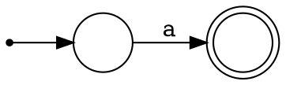
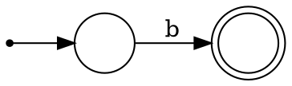
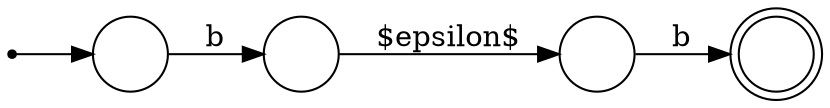

# (ab ∪ a)

## a

```dot
digraph finite_state_machine {
    rankdir=LR;
    size="8,5"

    A[label="", shape="circle" ]
    B[label="", shape="doublecircle"]
    qi[label="", shape="point"]

    qi -> A ;
    A -> B [ label = "a" ];

}
```

## b

```dot
digraph finite_state_machine {
    rankdir=LR;
    size="8,5"

    A[label="", shape="circle" ]
    B[label="", shape="doublecircle"]
    qi[label="", shape="point"]

    qi -> A ;
    A -> B [ label = "b" ];

}
```

# (ab ∪ a)

## ab

```dot
digraph finite_state_machine {
    rankdir=LR;
    size="8,5"

    A[label="", shape="circle" ]
    B[label="", shape="circle" ]
    C[label="", shape="circle" ]
    D[label="", shape="doublecircle"]
    qi[label="", shape="point"]

    qi -> A ;
    A -> B [ label = "b" ];
    B -> C [ label = "\$\epsilon\$" ];
    C -> D [ label = "b" ];

}
```
