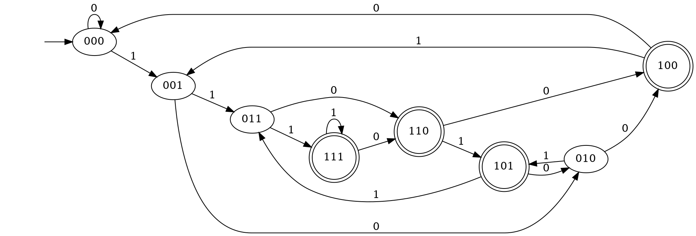
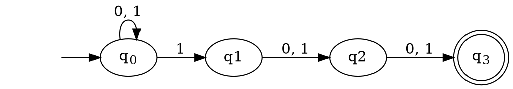
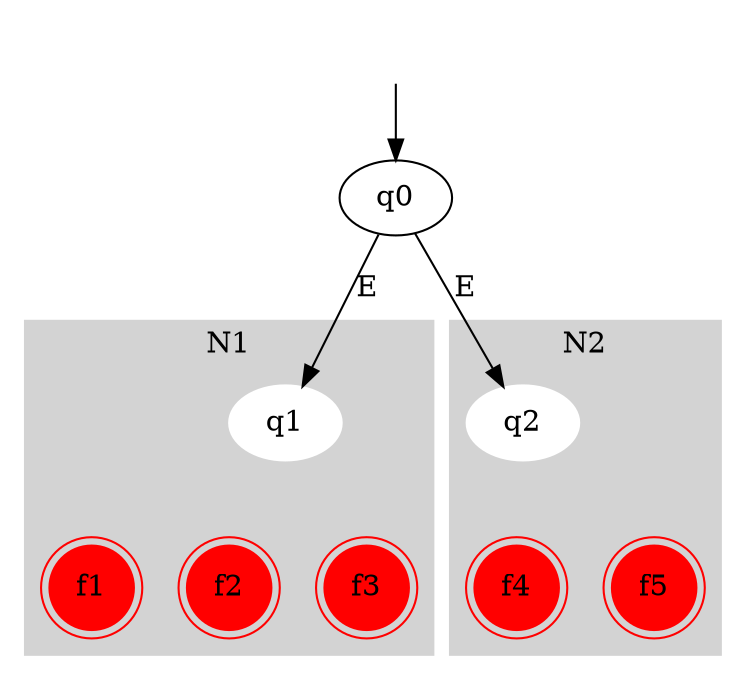
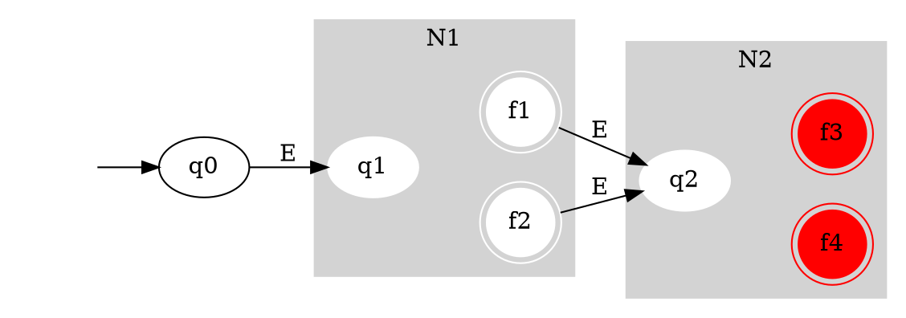
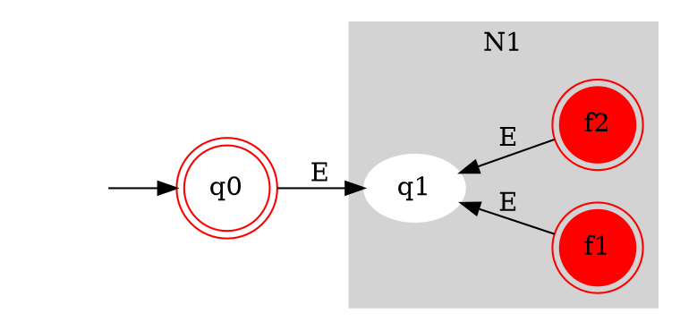

# Roadmap for Lecture 

* Review NFAs
* Prove that NFAs and DFAs are equivalent.
* Use NFAs to show that when each of the regular operation is applied on regular languages it yields yet another regular language.

# Review 

# NFA Definition

A non-deterministic finite automaton is a 5-tuple $(Q,\Sigma,\delta,q_0 ,F)$

1. Q is a finite set called the *states*.
2. $\Sigma$ is a finite set called the *alphabet*.
3. $\delta: Q \times \Sigma_\epsilon^* \rightarrow P(Q)$ is the *transition function*.
4. $q_0 \in Q$ is the *start state*, and
5. $F \subseteq Q$ ,is the set of *accept states*.

$^* \Sigma_\epsilon  = \Sigma \cup \{\epsilon\}$

# Differences Between NFAs and DFAs

1. The range of the transition function $\delta$ is now $P(Q)$.
2. The transition function allows $\epsilon$ transitions

# Equivalent FA

* These two finite automata are equivalent
* The NFA is much simpler to design and understand 

# NFA Equivalence 

* Now we prove that the class of NFAs is Equivalent to the class of DFA:
* Theorem: For every NFA N, there exists a DFA
 $M = M(N)$  such that 
 
 $$L(N)=L(M(N))$$

# Proof

* One technique of proving a theorem is called *proof by construction*
* Many theorems state that a particular type of object exists. 
* One way to prove such a theorem is by demonstrating how to construct the object.

# Proof Idea 

* We show how to build a DFA M that satisifes $L(N) = L(M(N))$
* Assume that we know N, construct a DFA that simulates M.

# Proof

* Let $N =(Q, \Sigma , \delta ,q_0,F)$, recognizing some language A. 
* The state set of the simulating DFA M, should reflect the fact that at each step of the computation, N may occupy several ssates.
* Thus we define the state set of M as P(Q) the power-set of the state set of N.

# Proof 

* Let $N =(Q, \Sigma , \delta ,q_0,F)$, recognizing some language A. 
* First we assume that N has no
$\epsilon$-transitions.
* Define $N =(Q', \Sigma , \delta ' ,q_0',F)$ where 

$$Q'=P(Q)$$

# Proof 

* Our next task is to define M’s transition
 function, $\delta '$:
* For any $R  \in Q'$ and $a \in \Sigma$ define

$$\delta '(R,a) = \{ q \in Q | q \in \delta (r,a) \text{ for some r} \in R\}$$

* If R is a state of M, then it is a set of states of N. 
* When M in state R processes an input symbol a, M goes to the set of states to which N will go in any of the branches of its computation.

# Proof

* An alternative way to write the definition of M's transition function, $\delta '$ is:
    * For any $R \in Q'$ and $a \in \Sigma$, define:
    * $\delta '(R, a) = \bigcup_{r \in R} \delta (r,a)$
* And the explanation is just the same
* Note: if $\bigcup_{r \in R} \delta (r,a) = \emptyset$ then $\delta '(R, a) = \emptyset$
    * Which is okay because $\emptyset \in P(Q)$.

# Proof 

* The initial state of M is $q_0' = \{q_0\}$
* The final state of M is:

$$F' = \{ R \in Q'\ |\ R \text{ contains a final state of } N\}\}$$

* Because M accepts if N reaches **at least one** accepting state
* Thus, M simulates N

# Proof

* It remains to consider $\epsilon$-transitions
* For any state R of M defined $E(R)$ to be the collection of states of R unified with the states reachable from R by $\epsilon$-transitions

# $\epsilon$-transitions

* The old definition of $\delta '(R,a)$ is:
$$\delta '(R,a) = \{ q \in Q | q \in \delta (r,a) \text{ for some r} \in R\}$$
* The new definition is:
$$\delta '(R,a) = \{ q \in Q | q \in E(\delta (r,a)) \text{ for some r} \in R\}$$

# Proof 

* In addition, we have to change the definition of $q_0'$, the initial state of M.
* The previous definition,

$q_0' = \{q_0\}$ is replaced with $q_0' = E(\{q_0\})$

* Once again the reader can verify that the new definition of M satisfies all requirements.

# Corollary

* A language L is **regular** if and only if there exists and NFA recognizing L.

# Reg. Operations

* Let A and B be 2 regular languages over the same alphabet, $\Sigma$.  We define the 3 regular operations:
    * Union: $A \cup B = \{ x | x \in A\ or\ x \in B\}$
    * Concatenation: $A \circ B = \{ xy | x \in A\ and\ y \in B\}$
    * Star: $A^* = \{ x_1, x_2, ..., x_k | k \geq 0\ and\ x_k \in A\}$

# Reg. Operations

$$
\begin{aligned}
A & = \{good, bad \} \\
B & = \{girl, boy\} \\
A \cup B & =\{good, bad, girl, boy\} \\ 
A \circ B & = \{goodgirl, goodboy,badgirl,badboy\} \\
A^* & = \{ \epsilon, good , bad , goodgood , goodbad, \\
& goodgoodgoodbad, badbadgoodbad, ...\}
\end{aligned}
$$

# Theorem Review

* The class of regular languages is **closed** under all three **regular operations**.

# Union Proof

* If A~1~ and A~2~ are regular, each has its own recognizing automaton N~1~ and N~2~, respectively.
* In order to prove that the language $A_1 \cup A_2$ is regular, we have to construct an NFA that accepts exactly the words in $A_1 \cup A_2$

# A Pictorial Proof

# Union Proof

* Let $N_1 = (Q_1, \Sigma,\delta_1,q_1,F_1)$ recognizing $A_1$
* Let $N_1 = (Q_2, \Sigma,\delta_2,q_2,F_2)$ recognizing $A_2$
* Construct $N = (Q, \Sigma,\delta,q_0,F)$ to recognize $A_1 \cup A_2$,
* Where $Q=\{q_0\} \cup Q_1 \cup Q_2$
* and $F = F_1 \cup F_2$,
* $q_0$ is a newly created start state and... 

# Union Proof 

$$\delta (q, a) = \begin{cases}
    \delta_1 (q, a), & q \in Q_1\\
    \delta_2 (q, a), & q \in Q_2\\
    \{q_1, q_2\} & q = q_0 \text{ and } a = \epsilon\\
    \emptyset & q = q_0 \text{ and } a \notin \epsilon
  \end{cases}$$

# Union Proof Overview

* By adding in a new start state with $\epsilon$-transitions to each of the other machines start states, we can recognize a union of two languages

# Theorem 1.26

The class of regular languages is closed under the concatenation operation

# Concatenation Proof

* Given an input word to be checked whether it belongs to $A_1 \circ A_2$, we may run $N_1$ until it reaches an accepting state and then to move to $N_2$

# Concatenation Proof

* The problem: whenever an accepting state is reached, we cannot be sure whether the word of $A_1$ is finished yet
* The idea: use non-determinism to choose the right point in which the word of $A_1$ is finished and the word of $A_2$ starts

# A Pictorial Proof

# Concatenation Proof

* By adding $\epsilon$-transitions from the final states of the first machine to the start state of the second machine, we can match the concatenation of the two languages

# Concatenation Proof

* Let $N_1 = (Q_1, \Sigma,\delta_1,q_1,F_1)$ recognizing $A_1$
* Let $N_2 = (Q_2, \Sigma,\delta_2,q_2,F_2)$ recognizing $A_2$
* Construct $N = (Q, \Sigma,\delta,q_1,F)$ to recognize $A_1 \circ A_2$ 
* Where $Q= Q_1 \cup Q_2$
* and $F = F_2$
* $\delta = ...$

# Concatenation Proof

$$\delta (q, a) = \begin{cases}
    \delta_1 (q, a), & q \in Q_1 \text{ and } q \notin F_1\\
    \delta_1 (q, a), & q \in F_1 \text{ and } a \neq \epsilon\\
    \delta_1 (q, a) \cup \{q_2\}     & q \in F_1 \text{ and } a = \epsilon\\
    \delta_2 (q,a)        & q \in Q_2
  \end{cases}$$

# Theorem 

The class of regular languages is closed under the star operation

# Pictorial Proof

# Star Proof

* Let $N_1 = (Q_1, \Sigma,\delta_1,q_1,F_1)$ recognizing $A_1$
* Construct $N = (Q, \Sigma,\delta,q_0,F)$ to recognize $A_1^*$ 
* Where $Q=\{q_0\} \cup Q_1 \cup Q_2$
* and $F = F_1 \cup \{q_0\}$,
* ...

# Star Proof

$$\delta (q, a) = \begin{cases}
    \delta_1 (q, a), & q \in Q_1 \text{ and } q \notin F_1\\
    \delta_1 (q, a), & q \in F_1 \text{ and } a \neq \epsilon\\
    \delta_1 (q, a) \cup \{q_1\}     & q \in F_1 \text{ and } a = \epsilon\\
    q_1        & q = q_0 \text{ and } a = \epsilon\\
    \emptyset        & q = q_0 \text{ and } a \neq \epsilon
  \end{cases}$$

# Star Proof

* By adding a new, accepting start state with an $\epsilon$ transition to the previous FAs start state and then adding $\epsilon$ transitions between the final states back to the previous FA's start state, we can always construct an NFA that recognizes $N^*$

# Wrap Up

* Proved equivalence between DFAs and NFAs
* Proved that the regular operations preserve regularity

# References, Resources

* [ADUni.org Lectures](https://www.youtube.com/playlist?list=PL601FC994BDD963E4)
* [UC San Diego Lecture Slides](https://cseweb.ucsd.edu/classes/fa08/cse105/)
