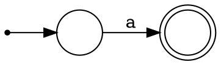
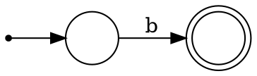
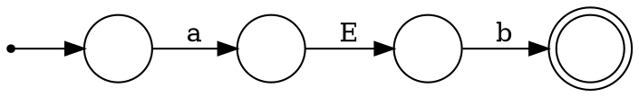
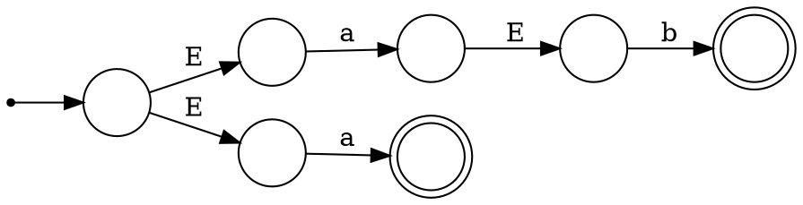
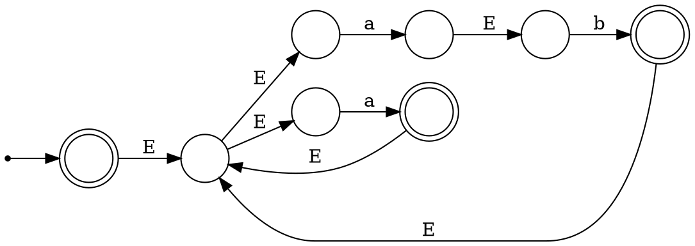
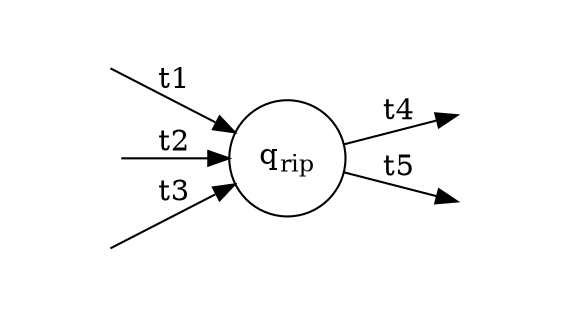

# Roadmap for Lecture 

* Review NFAs
* Prove that NFAs and DFAs are equivalent.
* Use NFAs to show that when each of the regular operation is applied on regular languages it yields yet another regular language.

# Review 

* **Theorem 1.45** The class of regular languages is closed under the union operation.
* **Theorem 1.47** The class of regular languages is closed under the concatenation operation.
* **Theorem 1.49** The class of regular languages is closed under the star operation.

# Regular Expressions

# Introduction

* Regular languages are defined and described by
use of **finite automata**.
* In this lecture, we introduce **Regular Expressions** as an equivalent way, yet more elegant, to describe regular languages.

# Motivation

* If one wants to describe a regular language, $L_a$ they can use the a DFA, D or an NFA N , such
that that $L ( D ) = L_a$
* This is not always very convenient.
* Consider for example the regular expression $0^*10^*$ describing the language of binary strings containing a single 1.

# Basic Regular Expressions

* A **Regular Expression** (RE in short) is a string of symbols that describes a **regular Language**.
- Let be an alphabet. For each $\sigma \in \Sigma$, the symbol $\sigma$ is an RE representing the set $\{\sigma\}$
- The symbol $\epsilon$ is an RE representing the set $\{\epsilon\}$ (The set containing the empty string).
- The symbol $\emptyset$ is an RE representing the empty set.

# Ind. Construction

* Let $R_1$ and $R_2$ be two regular expressions
representing languages $L_1$ and $L_2$, respectively
- The string $(R_1 \cup R_2)$ is a regular expression representing the set $L_1 \cup L_2$
- The string $(R_1 R_2)$ is a regular expression
    representing the set $L_1 \circ L_2$.
- The string $(R_1)^*$ is a regular expression representing the set $L_1^*$.

# Ind. Construction

* Note that in the inductive part of the definition
larger REs are defined by smaller ones. This
ensures that the definition is not **circular.**
* This inductive definition also dictates the way
we will prove theorems:
    * **Stage 1:** Prove $T_e$ correct for all base cases.
    * **Stage 2:** Assume $T_ e$ is correct for and and
prove its correctness for $(R_1 \cup R_2) (R_1 R_2) (R_1)^*$ 

# Useful Notation

* Let R be a regular expression
* The string $R^+$ represents $RR^*$, and it also holds that $R^+ \cup \{ \epsilon \} = R^*$
* The string $R^K$ represents $\underbrace{RR...R}_{k \text{ times}}$
* The string $\Sigma$ represents $\{ \sigma_1, \sigma_2, ..., \sigma_k\}$
* The Language represented by _R_ is denoted by $L(R)$

# Precedence Rules

- The star ($^*$) operation has the highest
    precedence.
- The concatenation ($\circ$ ) operation is second on
    the preference order.
- The union ($\cup$ ) operation is the least
    preferred.
- Parentheses can be omitted using these
    rules.

# Examples

* $0^*10*$ - { w | w contains a single 1 }
* $\Sigma^*1\Sigma^*$ - { w | w has at least a single 1 }
* $\Sigma^*(str)\Sigma^*$ - { w | w contains *str* as a substring}
* $1^*(01^+)^*$ - { w | every 0 in w is followed by at least a single 1}
* $(\Sigma \Sigma)^*$ - { w | w is of even length }

# Examples

- $0 \Sigma^* 0 \cup 1 \Sigma^*1 \cup 0 \cup 1$ -  all words starting and
    ending with the same letter**.**
- $(0 \cup \epsilon)1^* = 01^* \cup 1^*$ - all strings of forms
    1,11, 111... and 0,01,011...**.**
- $R \emptyset = \emptyset$ - A set concatenated with the
    empty set yields the empty set.
- $\emptyset^*$ - $\emptyset^* = \{\epsilon\}$ 

# FA Equivalence

* Regular expressions and finite automata are
equivalent in their descriptive power. 
* This fact is expressed in the following Theorem:
* **Theorem 1.54** A language is regular if and only if some regular expression describes it.
* The proof is by two Lemmata (Lemmas)

# If and Only If

* To prove this an "if and only if" statement, we must prove it in "both directions"
* We will express these two parts of the theorem as two lemmata (lemmas)
* **Theorem 1.54** A language is regular if and only if some regular expression describes it.
* We showed that this theorem must be proved in both directions:
    * **Lemma 1.55** If a language is described by a regular expression, then it is regular.
    * **Lemma 1.60** If a language is regular, then it is described by a regular expression.

# Lemma 1.55

* If a language _L_ can be described by regular
expression then _L_ is regular.

# Inductive Proofs

* This inductive definition of Regular expressions
dictates the way we will prove theorems. 
* The proof for the Theorem follows the following
stages:
    * **Stage 1:** Prove correctness for all base cases.
    * **Stage 2:** Assume correctness for $R_1$ and $R_2$, and show its correctness for 
    $$(R_1 \cup R_2), (R_1 R_2), \text{ and } (R_1)^*$$

# Induction Basis

* For any $\sigma \in \Sigma$, the expression $\sigma$ describes the set $\{ \sigma \}$, recognized by

# Induction Basis

* The set represented by the expression $\epsilon$ is recognized by:

# Induction Basis

* The set represented by the expression $\emptyset$ is recognized by:

# Induction Step

* Now, we assume that $R_1$ and $R_2$ represent two regular sets and claim that 
$$R_1 \cup R_2, R_1 \circ R_2 \text{ and } R_1^*$$
represent the corresponding regular sets.
* The proof for this claim is straight forward using the constructions given in the proof for the closure of the three regular operations.

# Examples

Show that the following regular expressions represent regular languages:

1. $(ab \cup a)^*$
2. $(a \cup b)^*aba$

# Example

1. $(ab \cup a)^*$

 <!--left hand main column-->

  <!--first row-->

$a$

 

 <!--row 2-->

$b$

 <!--end row 2-->

<!--row 3 -->

$ab$

<!--end row 3-->

 <!-- end left column>

 <!-- begin right main column>

 <!-- end right main column -->

 <!-- end main container -->

# Example 1 

 <!-- L row 1-->

$ab \cup a$ 

# Example 1

 <!-- R row 2-->

$(ab \cup a)^*$ 

 <!-- end row -->

# Example 2

2. $(a \cup b)^*aba$

Design the NFA that recognizes the language of this regular expression.

# Lemma 1.60

If a language L is regular then L can be describe by a regular expression

# Proof Stages

The proof follows the following stages:

1. Define Generalized Nondeterministic Finite
    Automaton (GNFA in short).
2. Show how to convert any DFA to an
    equivalent GNFA.
3. Show an algorithm to convert any GNFA to an
    equivalent GNFA with 2 states.
4. Convert a 2-state GNFA to an equivalent RE.

# GNFA Properties

1. A GNFA is a finite automaton in which each
    transition is labeled with a regular expression
    over the alphabet.
2. A single **initial state** with all possible
    outgoing transitions and no incoming transitions
3. A single **final state** without outgoing transitions
4. A single transition between every two states,
    including self loops.

# Example of a Generalized NFA

# GNFA Computation

* A **_computation_** of a GNFA is similar to a
computation of an NFA. except:
* In each step, a GNFA consumes **_a block of
symbols_** that matches the RE on the
transition used by the NFA.

# Example of a GNFA Computation

Consider _abbbaaaaabbbbb_ or _bb_ or _abba_

# DFA->GNFA Conversion

Conversion is done by a very simple process:

1. Add a new start state with an $\epsilon$-transition
    from the **new** start state to the **old** start
    state.
2. Add a new accepting state with $\epsilon$-transition
    from every **old** accepting state to the **new**
    accepting state.

# DFA->GNFA Conversion

3. Replace any transition with multiple labels by
    a single transition labeled with the **_union_** of
    all labels.
4. Add any missing transition, including self
    transitions; label the added transition by $\emptyset$.

# DFA->GNFA Conversion

* The final element needed for the proof is a
procedure in which for any GFN _G_ , any state
of _G_ , not including $q_{start}$ and $q_{accept}$, can be
**ripped** off _G_ , while preserving the language.
* This is demonstrated in the next slide by
considering a general state, denoted by $q_{rip}$ ,
and an arbitrary pair of states, $q_i$ and $q_j$

# State Removal

  <!--first row-->

#### Before Ripping 

#### After Ripping 

*Note: this should be done for **every pair** of outgoing and incoming transitions for $q_{rip}$

# Elaboration

  <!--first row-->

* Consider the RE $(R_1)(R_2)^*R_3$, representing all strings that enable transition from $q_i$ via $q_{rip}$ to $q_j$.

* What we want to do is to augment the Regular expression of transition $(q_i, q_j)$, namely $R_4$, so these strings can pass through $(q_i, q_j)$
* This is done by setting it to $R_4 \cup (R_1)(R_2)^*R_3$

# Elaboration

  <!--first row-->

* Note that this change does not affect all pairs in which either $(q_i, q_{rip}$ or $(q_j, q_{rip}$ participate.
* Thus, before is removed all these pairs should be processed in the same way, as demonstrated on the next slide.

# Elaboration

* In order to rip , all pairs of incoming and outgoing transitions should be considered in the way showed on the
previous slide
* Specifically consider: (t1, t4), (t1, t5), (t2, t4), (t2, t5), (t3, t4), (t3, t5), one after the other
* After that $q_{rip}$ can be ripped while preserving $L(G)$.

# Partial Proof

* The first step is to formally define a GNFA.
* Each transition should be labeled with an RE.
* Define the transition function as follows:

$$\delta : (Q - \{q_{accept}\}) \times (Q - \{q_{start}\})\longrightarrow RE_\Sigma$$

* where $RE_\Sigma$ denotes all regular expressions
over $\Sigma$.

# Changes in delta Definition

$$\delta : (Q - \{q_{accept}\}) \times (Q - \{q_{start}\})\longrightarrow RE_\Sigma$$

* **Note: this definition is different than the original definitions (For
DFA and NFA).
* In this definition we rely on the fact that every 2
states (except and ) are connected in
both directions.

# GNFA Definition

A Generalized Finite Automaton is a 5-tuple $(Q,\Sigma,\delta,q_0 ,F)$

1. Q is a finite set called the *states*.
2. $\Sigma$ is a finite set called the *alphabet*.
3. $\delta : (Q - \{q_{accept}\}) \times (Q - \{q_{start}\})\rightarrow RE_\Sigma$ is the *transition function*.
4. $q_{start} \in Q$ is the *start state*, and
5. $q_{accept} \in Q$ ,is the *accept state*.

# Defining GNFA Computation

* A GNFA **_accepts_** a string $w \in \Sigma^*$ if $w=w_1w_2...w_k$ and there exists a sequence of states
$q_{start}q_1q_2...q_{accept}$, satisfying:
* For each $i, 1 \leq i \leq k, w_i \in L(R_i)$ 
* where $R_i = \delta(q_{i-1}, q_i)$, or in other words, is the
expression on the arrow from $q_i$ to $q_{i+1}$.

# CONVERT 

* Procedure _CONVERT_ takes as input a GNFA _G with k_ states.
* If $k=2$ then these 2 states must be $q_{start}$ and $q_{end}$, and the algorithm returns $\delta(q_{start}, q_{end}$
* If $k>2$, the algorithm converts _G_ to an equivalent _G’_ with $k-1$ states by use of the ripping procedure described before.

# CONVERT {.eighty}

1. $k \longleftarrow|Q_G|;$
2. $if(k=2)$ return $\delta(q_{start}, q_{end});$
3. $q_{rip} \longleftarrow GetRandomState(Q_G);$
4. $Q' \longleftarrow Q_G - q_{rip};$
5. $\text{For any }q_i \in Q'-q_{accept} \text{ and any } q_j \in Q'-q_{start}:$

$$
\delta : (Q - \{q_{accept}\}) \times (Q - \{q_{start}\})\longrightarrow RE_\Sigma \\
for R_1 = \delta(q_i, q_{rip})  R_2 = \delta(q_{rip}, q_{rip}) R_3=\delta(q_{rip}, q_i) R_4 = \delta(q_i, q_j)
$$
6. $\text{return }G' = (Q', \Sigma, \delta ', q_{start}, q_{accept});$

# Example: NFA-> GNFA-> RE

 

# Example: NFA -> GNFA -> RE

 <!--left hand main column-->

 <!--right hand main column-->

# Example: NFA -> GNFA -> RE

 <!--left hand main column-->

 <!--right hand main column-->

# Example: NFA -> GNFA -> RE

 <!--left hand main column-->

 <!--right hand main column-->

# Review

* In this lecture we introduced a new theorem:
* **Theorem 1.54** A language is regular if and only if some regular expression describes it.
* We showed that this theorem must be proved in both directions:
    * **Lemma 1.55** If a language is described by a regular expression, then it is regular.
    * **Lemma 1.60** If a language is regular, then it is described by a regular expression.

# Review 

1. Motivated and defined regular expressions as
    a more concise and elegant method to
    represent **Regular Languages**.
2. Proved that FAs (Deterministic as well as
    Nondeterministic) and REs is identical by:
    2.1 Defined GNFAs.
    2.2 Showed how to convert a DFA to a GNFA.
    2.3 Showed an algorithm to converted a
       GNFA with K states to an equivalent
       GNFA with K-1 states.

# References, Resources

* [ADUni.org Lectures](https://www.youtube.com/playlist?list=PL601FC994BDD963E4)
* [UC San Diego Lecture Slides](https://cseweb.ucsd.edu/classes/fa08/cse105/)

