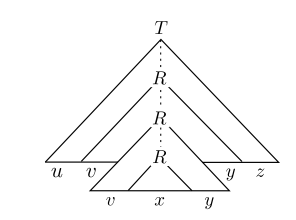
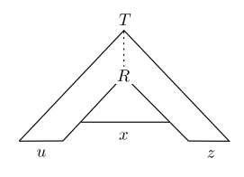

# Review

* The Pumping Lemma is the formal tool we use to prove that the language B (as well as many other languages) is not regular.

# The Pumping Lemma 

$$
\text{If A is a regular language and } \\ \exists p = \text{ the number of states in any machine for A }. \\
\forall w \text{ in A where } |w| \geq p \\ 
\exists x,y,z \text{ where } w = xyz, |y| > 0, |xy| \leq p \\
\forall i > 0, xy^iz \in A 
$$ 

# Review

# Context-Free Grammars

# Introduction 

* In this chapter we present context-free grammars (CFGs), a more powerful method of describing languages.
* Such grammars can describe certain features that have a recursive structure, which makes them useful in a variety of applications.

# CFGs

* Context-free grammars were first used in the study of human languages.
* One way of understanding the relationship of terms such as noun, verb, and preposition and their respective phrases leads to a natural recursion because noun phrases may appear inside verb phrases and vice versa.
* Context-free grammars help us organize and understand these relationships.

# Application

* An important application of context-free grammars occurs in the specification and compilation of programming languages.
* A grammar for a programming language often appears as a reference for people trying to learn the language syntax.
* Most compilers and interpreters contain a component called a parser that extracts the meaning of a program prior to creating the compiled code or performing the interpreted execution.

# Context-free Grammars

# CFGs

* The following is an example of a context-free grammar, which we call G~1~.

$$
A \longrightarrow 0A1 \\
A\longrightarrow B \\
B\longrightarrow \#
$$

# CFG Components

* collection of **substitution rules**, also called productions.
* Each rule appears as a line in the grammar, comprising a symbol and a string separated by an arrow.
* The symbol is called a **variable**.
* The string consists of variables and other symbols called **terminals**.

# CFGs

* The variable symbols often are represented by capital letters.
* The terminals are analogous to the input alphabet and often are represented by lowercase letters, numbers, or special symbols.
* One variable is designated as the **start variable**.
* It usually occurs on the left-hand side of the topmost rule.

# Example CFG G1

$$
A \longrightarrow 0A1 \\
A\longrightarrow B \\
B\longrightarrow \#
$$

* For example, grammar G~1~ contains three rules.
* G~1~’s variables are A and B, where A is the start variable.
* Its terminals are 0, 1, and #.

# Generating Strings

1. Write down the start variable. It is the variable on the left-hand side of the top rule, unless specified otherwise.
2. Find a variable that is written down and a rule that starts with that variable. Replace the written down variable with the right-hand side of that rule.
3. Repeat step 2 until no variables remain.

# Generating

G1:
$$
A \longrightarrow 0A1 \\
A\longrightarrow B \\
B\longrightarrow \#
$$

* G~1~ generates 000#111.  
* The sequence of substitutions to obtain a string is called its **derivation**.  

# Derivation

$$
A \longrightarrow 0A1 \\
A\longrightarrow B \\
B\longrightarrow \#
$$

* A derivation of string 000#111 in grammar G~1~ is:
$$ A \Rightarrow 0A1 \Rightarrow 00A11 \Rightarrow 000A111 \\ \Rightarrow 000B111 \Rightarrow 000\#111 $$

# Parse Tree

A derivation may be pictures pictorially using a **parse tree**.

# Parse Tree

{.stretch}

# Context-Free Languages

* All strings generated in this way constitute the language of the grammar.
* We write $L(G_1)$ for the language of Grammar $G_1$.
* $L(G_{1}) = \{0^n\#1^n | n \geq 0\}$
* **Any language that can be generated by some context-free grammar is called a context-free language (CFL)**

# CFG Example G2 {.seventy}

$${\scriptsize\begin{aligned}⟨SENTENCE⟩ &\longrightarrow ⟨NOUN-PHRASE⟩⟨VERB-PHRASE⟩
\\ ⟨NOUN-PHRASE⟩ &\longrightarrow ⟨CMPLX-NOUN⟩ | ⟨CMPLX-NOUN⟩⟨PREP-PHRASE⟩
\\ ⟨VERB-PHRASE⟩ &\longrightarrow ⟨CMPLX-VERB⟩ | ⟨CMPLX-VERB⟩⟨PREP-PHRASE⟩
\\ ⟨PREP-PHRASE⟩ &\longrightarrow ⟨PREP⟩⟨CMPLX-NOUN⟩
\\ ⟨CMPLX-NOUN⟩ &\longrightarrow ⟨ARTICLE⟩⟨NOUN⟩
\\ ⟨CMPLX-VERB⟩ &\longrightarrow ⟨VERB⟩ | ⟨VERB⟩⟨NOUN-PHRASE⟩
\\ ⟨ARTICLE⟩ &\longrightarrow a | the
\\ ⟨NOUN⟩ &\longrightarrow boy | girl | flower
\\ ⟨VERB⟩ &\longrightarrow touches | likes | sees
\\ ⟨PREP⟩ &\longrightarrow with
\end{aligned} } $$

# CFG Example G2

Grammar G~2~ has:

* 10 variables (the capitalized grammatical terms written inside brackets)
* 27 terminals (the standard English alphabet plus a space character)
* 18 rules.

# CFG Example G2

Strings in L(G~2~) include:

* a boy sees
* the boy sees a flower
* a girl with a flower likes the boy

# CFG Example G2 {.seventy}

The following is a derivation of `a boy sees`:

$$\begin{aligned}⟨SENTENCE⟩ &\Rightarrow ⟨NOUN-PHRASE⟩⟨VERB-PHRASE⟩ \\ &\Rightarrow ⟨CMPLX-NOUN⟩⟨VERB-PHRASE⟩
\\ &\Rightarrow ⟨ARTICLE⟩⟨NOUN⟩⟨VERB-PHRASE⟩ \\ &\Rightarrow a ⟨NOUN⟩⟨VERB-PHRASE⟩
\\ &\Rightarrow a\, boy ⟨VERB-PHRASE⟩
\\ &\Rightarrow a\, boy ⟨CMPLX-VERB⟩
\\ &\Rightarrow a\, boy ⟨VERB⟩ \\ &\Rightarrow a\, boy\ sees \end{aligned}$$

# Formal Definition

# Formal Definition of a CFG

A context-free grammar is a 4-tuple (V, Σ, R, S), where:

1. V is a finite set called the variables,
2. Σ is a finite set, disjoint from V , called the terminals,
3. R is a finite set of rules, with each rule being a variable and a
string of variables and terminals, and
4. S ∈ V is the start variable.

# Terminology

* If u, v, and w are strings of variables and terminals, and A → w is a rule of the grammar, we say that uAv **yields** uwv, written uAv ⇒ uwv.
* Say that u **derives** v, written u $\xRightarrow{*}$ v, if $u = v$ or if a sequence $u_{1},u_{2},...,u_{k}$ exists for k ≥ 0 and

$$ u \Rightarrow u_{1} \Rightarrow u_{2} \Rightarrow ...\Rightarrow u_{k}\Rightarrow v.$$

# Language of a Grammar 

* The language of the grammar is:

$$\{w \isin \Sigma ^∗\ |\ S \xRightarrow{*} w\}.$$

# Example G4 {.eighty}

Consider grammar G~4~ =(V,Σ,R,⟨EXPR⟩).

* V is {⟨EXPR⟩,⟨TERM⟩,⟨FACTOR⟩}
* Σ is {a,+, x,(,)}
* The rules are:

$$\begin{aligned}⟨EXPR⟩ &\Rightarrow ⟨EXPR⟩+⟨TERM⟩\ |\ ⟨TERM⟩ \\
⟨TERM⟩ &\Rightarrow ⟨TERM⟩\times \text{⟨FACTOR⟩ |  ⟨FACTOR⟩} \\
  ⟨FACTOR⟩ &\Rightarrow \text{ (⟨EXPR⟩) | a } \end{aligned} $$

# Example G4 {.ninety}

$$\begin{aligned}⟨EXPR⟩ &\Rightarrow ⟨EXPR⟩+⟨TERM⟩\ |\ ⟨TERM⟩ \\
⟨TERM⟩ &\Rightarrow ⟨TERM⟩\times \text{⟨FACTOR⟩ |  ⟨FACTOR⟩} \\
  ⟨FACTOR⟩ &\Rightarrow \text{ (⟨EXPR⟩) | a } \end{aligned} $$

Draw parse trees for $a+a\times a$ and $(a+a)\times a$.

# Example G4 {.eighty}

Draw parse trees for $a+a\times a$ and $(a+a)\times a$.

# Compiler

* A compiler translates code written in a programming language into another form, usually one more suitable for execution.
* To do so, the compiler extracts the meaning of the code to be compiled in a process called parsing.
* One representation of this meaning is the parse tree for the code, in the context-free grammar for the programming language

# Designing Context-Free Grammars

# Designing CFGs

* As with the design of finite automata, the design of context-free grammars requires creativity.
* Context-free grammars are even trickier to construct than finite automata because we are more accustomed to programming a machine for specific tasks than we are to describing languages with grammars.

# Technique 1 {.ninety}

* Many CFLs are the union of simpler CFLs. If you must construct a CFG for a CFL that you can break into simpler pieces, do so and then construct individual grammars for each piece.
* These individual grammars can be easily merged into a grammar for the original language by combining their rules
* Then add the new rule $S → S_{1} | S_{2} | ··· | S_{k},$ where the variables $S_i$ are the start variables for the individual grammars

# Technique 2

* Constructing a CFG for a language that happens to be regular is easy if you can first construct a DFA for that language.
* You can convert any DFA into an equivalent CFG as follows.

# Technique 2 {.ninety}

1. Make a variable $R_i$ for each state qi of the DFA.
2. Add the rule $R_i \longrightarrow aR_j$ to the CFG if $\delta(q_i,a) = q_j$ is a transition in the DFA.
3. Add the rule $R_i \longrightarrow \epsilon$ if $q_i$ is an accept state of the DFA.
4. Make $R_0$ the start variable of the grammar, where $q_0$ is the start state of the machine.
5. Verify on your own that the resulting CFG generates the same language that the DFA recognizes.

# Technique 3 {.ninety}

* CFLs contain strings with two substrings that are “linked” in the sense that a machine for such a language would need to remember an unbounded amount of information about one of the substrings to verify that it corresponds properly to the other substring
* This situation occurs in the language $\{0^n1^n| n \geq 0\}$ because a machine would need to remember the number of 0s in order to verify that it equals the number of 1s.

# Technique 3

* You can construct a CFG to handle this situation by using a rule of the form R → uRv, which generates strings wherein the portion containing the u’s corresponds to the portion containing the v’s.

# Technique 4

* In more complex languages, the strings may contain certain structures that appear recursively as part of other (or the same) structures.
* That situation occurs in the grammar that generates arithmetic expressions in Example 2.4.

# Technique 4

* Any time the symbol a appears, an entire parenthesized expression might appear recursively instead.
* To achieve this effect, place the variable symbol generating the structure in the location of the rules corresponding to where that structure may recursively appear.

# Ambiguity

# Ambiguity

* Sometimes a grammar can generate the same string in several different ways.
* Such a string will have several different parse trees and thus several different meanings.
* This result may be undesirable for certain applications, such as programming languages, where a program should have a unique interpretation.

# Ambiguity

* If a grammar generates the same string in several different ways, we say that the string is derived ambiguously in that grammar.
* If a grammar generates some string ambiguously, we say that the grammar is ambiguous.

# Ambiguity

Consider G5:

⟨EXPR⟩ → ⟨EXPR⟩+⟨EXPR⟩ | ⟨EXPR⟩x⟨EXPR⟩ |(⟨EXPR⟩)|a

This grammar generates the string a + a x a ambiguously.

# Ambiguity

Consider G5:

⟨EXPR⟩ → ⟨EXPR⟩+⟨EXPR⟩ | ⟨EXPR⟩x⟨EXPR⟩ |(⟨EXPR⟩)|a

# Ambiguity

* Sometimes when we have an ambiguous grammar we can find an unambiguous grammar that generates the same language.
* Some context-free languages, however, can be generated only by ambiguous grammars. Such languages are called _inherently ambiguous_.

# Formal Defintion of Ambiguity (2.7)

A string w is derived ambiguously in context-free grammar G if it has two or more different leftmost derivations. Grammar G is ambiguous if it generates some string ambiguously.

# Leftmost Derivation

A derivation of a string w in a grammar G is a leftmost derivation if at every step the leftmost remaining variable is the one replaced.

# Chomsky Normal Form

# Chomsky Normal Form

When working with context-free grammars, it is often convenient to have them in simplified form. One of the simplest and most useful forms is called the Chomsky Normal Form.

# Chomsky Normal Form {.eighty}

* A context-free grammar is in Chomsky normal form if every rule is of the form:

$$ \begin{aligned} A &\longrightarrow BC \\ A &\longrightarrow a \end{aligned} $$

* where a is any terminal 
* and A, B, and C are any variables—except that B and C may not be the start variable. 
* In addition, we permit the rule S → ε, where S is the start variable.

# Conversion to CNF

1. Add a new start variable $S_0$ and the rule $S_0$ → S, where S was the original start variable.
2. Take care of all ε-rules. We remove an ε-rule A → ε, where A is not the start variable. Then for each occurrence of an A on the right-hand side of a rule, we add a new rule with that occurrence deleted.
3. Remove all unit rules. We remove a unit rule A → B.

# Conversion to CNF {.ninety}

4. Finally, we convert all remaining rules into the proper form. 
* We replace each rule $A → u_{1}u_{2} ···u_{k}$, where k ≥ 3 and each $u_i$ is a variable or terminal symbol,with the rules $A → u_{1}A_{1}, A_{1} → u_{2}A_{2}, \\ A_{2} → u_{3}A_{3},  ...\text{ , and }A_{k}−2 → u_{k−1}u_{k}$. 
* The $A_{i}$’s are new variables. 
* We replace any terminal $u_{i}$ in the preceding rule(s) with the new variable $U_{i}$ and add the rule $U_{i} → u_{i}$.

# Conversion Example {.ninety}

Initial Grammar G~6~:
$$ \begin{aligned} S &\longrightarrow ASA\ |\ aB \\ A&\longrightarrow B\ |\ S \\ B &\longrightarrow b\ |\ \epsilon \end{aligned}$$

First, add new start rule $S_0$.

# Conversion Example {.ninety}

1. Add new start rule S~0~:
$$ \begin{aligned} S_0 &\longrightarrow S \\ S &\longrightarrow ASA\ |\ aB \\ A&\longrightarrow B\ |\ S \\ B &\longrightarrow b\ |\ \epsilon \end{aligned}$$

Second, take care of all ε-rules.

# Conversion Example {.ninety}

2a. Take care of all $B \longrightarrow \epsilon$-rules:
$$ \begin{aligned} S_0 &\longrightarrow S \\ S &\longrightarrow ASA\ |\ aB\ |\ a \\ A&\longrightarrow B\ |\ S\ |\ \epsilon \\ B &\longrightarrow b \end{aligned}$$

Next, remove all $A \longrightarrow \epsilon$-rules.

# Conversion Example {.ninety}

2b. Take care of all $A \longrightarrow \epsilon$-rules:
$$ \begin{aligned} S_0 &\longrightarrow S \\
S &\longrightarrow ASA\ |\ aB\ |\ a \ |\ SA\ |\ AS\ |\ S\\
A&\longrightarrow B\ |\ S \\
 B &\longrightarrow b \end{aligned}$$

Next, remove all unit rules.

# Conversion Example {.ninety}

3a. Remove unit rule $S\longrightarrow S$
$$ \begin{aligned} S_0 &\longrightarrow S \\
S &\longrightarrow ASA\ |\ aB\ |\ a \ |\ SA\ |\ AS \\
A&\longrightarrow B\ |\ S \\
 B &\longrightarrow b \end{aligned}$$

Next, remove unit rule $S_0 \longrightarrow S$

# Conversion Example {.ninety}

3b. Remove unit rule $S_0 \longrightarrow S$

$$ \begin{aligned} S_0 &\longrightarrow ASA\ |\ aB\ |\ a \ |\ SA\ |\ AS\ \\
S &\longrightarrow ASA\ |\ aB\ |\ a \ |\ SA\ |\ AS \\
A&\longrightarrow B\ |\ S \\
 B &\longrightarrow b \end{aligned}$$

Next, remove unit rule $A\longrightarrow B$

# Conversion Example {.ninety}

3c. Remove unit rule $A\longrightarrow B$
$$ \begin{aligned} S_0 &\longrightarrow ASA\ |\ aB\ |\ a \ |\ SA\ |\ AS\ \\
S &\longrightarrow ASA\ |\ aB\ |\ a \ |\ SA\ |\ AS \\
A&\longrightarrow  S\ |\ b \\
 B &\longrightarrow b \end{aligned}$$

Next, remove unit rule $A\longrightarrow S$

# Conversion Example {.ninety}

3c. Remove unit rule $A\longrightarrow S$
$$ \begin{aligned} S_0 &\longrightarrow ASA\ |\ aB\ |\ a \ |\ SA\ |\ AS\ \\
S &\longrightarrow ASA\ |\ aB\ |\ a \ |\ SA\ |\ AS  \\
A&\longrightarrow   b\ |\ ASA\ |\ aB\ |\ a \ |\ SA\ |\ AS\ \\
 B &\longrightarrow b \end{aligned}$$

# Conversion Example {.ninety}

* Next, convert remaining rules to the proper form by adding additional variables and rules.
* No rule should have a mix of variables and terminals, and it should have no more than 2 variables in each production.
* The final grammar is equivalent to $G_6$.

# Conversion Example {.ninety}

Initial Grammar G~6~:
$$ \begin{aligned} S &\longrightarrow ASA\ |\ aB \\ A&\longrightarrow B\ |\ S \\ B &\longrightarrow b\ |\ \epsilon \end{aligned}$$

# Conversion Example {.ninety}

G~6~ equivalent in CNF:
$$ \begin{aligned} S_0 &→AA_{1}\ |\ UB\ |\ a\ |\ SA\ |\ AS \\
S &→ AA_{1}\ |\ UB\ |\ a\ |\ SA\ |\ AS \\
A &→b\ |\ AA_{1}\ |\ UB\ |\ a\ |\ SA\ |\ AS \\
A_{1} &→ SA \\
U&→a \\
B&→b \end{aligned}$$

# Review

* In this chapter we present context-free grammars (CFGs), a more powerful method of describing languages.
* Such grammars can describe certain features that have a recursive structure, which makes them useful in a variety of applications.

# CFGs

* Context-free grammars were first used in the study of human languages.
* One way of understanding the relationship of terms such as noun, verb, and preposition and their respective phrases leads to a natural recursion because noun phrases may appear inside verb phrases and vice versa.
* Context-free grammars help us organize and understand these relationships.

# CFGS

* CFGs *generate* strings
* Strings can be *derived* from CFGs
* Some strings may be *ambiguous*
* CFGs can be convereted to a standard form known as Chomsky Normal Form
* CFGs are important in their application to compilation