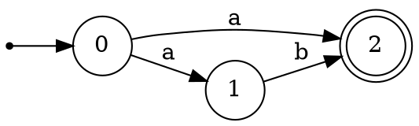
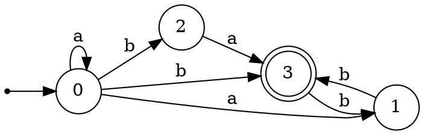

# NFA Practice

Design an NFA for each of the languages below.  For each language, $\Sigma$ = {a, b}.

1. { w \| w ends in ab }
2. { w \| w contains a substring *aba*}
3. { w \| w has an odd number of a’s }
4. { w \| w has an even length }
5. { w \| w starts with an a }
6. { w \| w's third symbol from the end is a b}

# NFA Practice
7. Identify the language in the following NFA:

# NFA Practice 

8. Identify the language in the following NFA:

