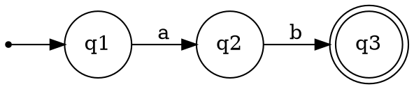
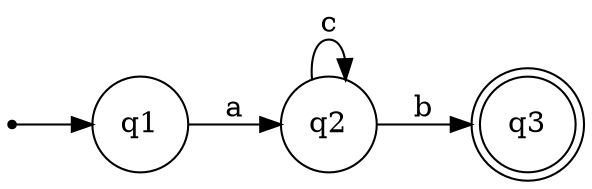
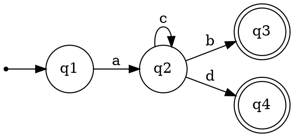

# Regular Expression Practice

[Reference: Aduni](http://www.aduni.org/courses/theory/courseware/handouts/Recitation_03.html)

*Give one string that is in the language and one that is not:*

1.  `a*b*`
2.  `a(ba)*b`
3.  `a* + b*`
4.  `(b + aaa)*`
5.  `aba+bab`

*Write a regular expression*

6.    That accepts the set of all strings.

7.    That accepts the set of all strings not containing 00 as a substring.

*Convert to regular expressions:*

8.

9.

10.

*Convert to an NFA:*

11.  `(001)*(1+e)`
12.  `(01*0 + e + 00)`
13.  `(001)*(1+e)(01*0 + e + 00)`
