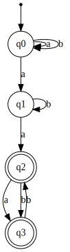
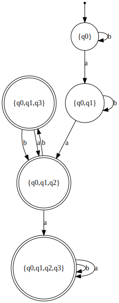
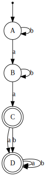

## Converting an NFA to a DFA

Given the following NFA:


```python
conversion_nfa1 = NFA(
    states={'q0', 'q1', 'q2', 'q3'},
    input_symbols={'a', 'b'},
    transitions={
        'q0': {'a': {'q0', 'q1'}, 'b': {'q0'}},
        'q1': {'a': {'q2'}, 'b': {'q1'}},
        'q2': {'a': {'q3'}, 'b': {'q3'}},
        'q3': {'b': {'q2'}}
    },
    initial_state='q0',
    final_states={'q2', 'q3'}
)

image=generate_nfa_image(conversion_nfa1, "NFA 1")
image
```




How could we convert NFA _m_ to a DFA?

What if we changed some states to represent one or the other?


```python
converted_dfa = DFA(conversion_nfa1)
image=generate_dfa_image(converted_dfa, "DFA Converted from NFA")
image
```





Is this NFA really equal?  We can run a few tests...


```python
#from automata.shared import *

#print(list(converted_dfa.validate_input(the_string, step=True)))

def the_comparison(the_string):    
    print(list(conversion_nfa1.validate_input(the_string, step=True)))
    print(list(converted_dfa.validate_input(the_string, step=True)))


the_comparison("aa")
#the_comparison("bbaba")
#the_comparison("aa")


```

    [{'q0'}, {'q0', 'q1'}, {'q2', 'q0', 'q1'}]
    ['{q0}', '{q0,q1}', '{q0,q1,q2}']


Let's see that original NFA again:


```python
image=generate_nfa_image(conversion_nfa1, "NFA 1")
image
```


The script did a fine job of converting that NFA to a DFA, but how could we convert it on our own?

# NFA to DFA Conversion Algorithm

To convert the NFA to a DFA, we may use the following algorithm:

1. Identify the start state.
2. For this state, record the output of the transition function for each symbol in Σ.  If the resulting output has not been marked before, put an asterisk beside it.  These new sets of states will become the new states of our DFA.
3. For each new state marked with an asterisk ( * ), repeat step 2.  When you have recorded the transition function for all marked states, you may proceed to step 4.
4. List all the start state and all of the marked states down the first column of a new transition table.  Complete the transition table for each symbol of output.
5. If any states transition to an empty set, create a dead state and route all of the empty sets to this dead state.
6. The start state from the original NFA will be the start state of the new DFA.  Mark it with an arrow.
7. Go through the list of new states and see if any of the final states from the original NFA are represented in the states.  If they are, mark them with an asterisk to denote that they are a final state for the DFA.
8. You have now completed the DFA design, using a transition table.  You may rename the state names to simple names if you wish. You also may create a DFA state diagram if you wish.

# Example

Now, let's apply these steps to our example:

>1. Identify the start state.

q0.

>2. For this state, record the output of the transition function for each symbol in Σ.  If the resulting output has not been marked before, put an asterisk beside it.  These new sets of states will become the new states of our DFA.

δ(q0,a) = {q0,q1} <sup> * </sup>
δ(q0,b) = {q0}

>3. For each new state marked with an asterisk (*), repeat step 2.  If there is more than one item in the input state, then create the result by taking a union of the individual transitions.  When you have recorded the transition function for all marked states, you may proceed to step 4.


* δ({q0, q1},a) = δ(q0,a) ∪ δ(q1,a) = {q0,q1,q2} <sup> * </sup>
* δ({q0, q1},b) = δ(q0,b) ∪ δ(q1,b) = {q0,q1}

---

* δ({q0, q1, q2},a) = δ(q0,a) ∪ δ(q1,a) ∪ δ(q2,a) =  {q0,q1,q2,q3} <sup> * </sup>
* δ({q0, q1, q2},b) = δ(q0,b) ∪ δ(q1,b) ∪ δ(q2,b) = {q0,q1,q2,q3}

---

* δ({q0, q1, q2, q3},a) = δ(q0,a) ∪ δ(q1,a) ∪ δ(q2,a) ∪ δ(q3,a) =  {q0,q1,q2,q3}
* δ({q0, q1, q2, q3},b) = δ(q0,b) ∪ δ(q1,b) ∪ δ(q2,b) ∪ δ(q3,b) = {q0,q1,q2,q3}

> 4. List all the start state and all of the marked states down the first column of a new transition table.  Complete the transition table for each symbol of output.

| δ/Σ           | a             | b             |
|---------------|---------------|---------------|
| {q0}          | {q0,q1}       | {q0}          |
| {q0,q1}       | {q0,q1,q2}    | {q0,q1}       |
| {q0,q1,q2}    | {q0,q1,q2,q3} | {q0,q1,q2,q3} |
| {q0,q1,q2,q3} | {q0,q1,q2,q3} | {q0,q1,q2,q3} |

>5. If any states transition to an empty set, create a dead state and route all of the empty sets to this dead state.
No empty sets in the table.

>6. The start state from the original NFA will be the start state of the new DFA.  Mark it with an arrow.

| δ/Σ           | a             | b             |
|---------------|---------------|---------------|
| ⇒{q0}         | {q0,q1}       | {q0}          |
| {q0,q1}       | {q0,q1,q2}    | {q0,q1}       |
| {q0,q1,q2}    | {q0,q1,q2,q3} | {q0,q1,q2,q3} |
| {q0,q1,q2,q3} | {q0,q1,q2,q3} | {q0,q1,q2,q3} |

>7. Go through the list of new states and see if any of the final states from the original NFA are represented in the states.  If they are, mark them with an asterisk to denote that they are a final state for the DFA.

q2 is the final state for the original NFA.  Therefore, {q0, q1, q2}, and {q0, q1, q2, q3} are final states for the new DFA:

| δ/Σ            | a             | b             |
|----------------|---------------|---------------|
| ⇒{q0}          | {q0,q1}       | {q0}          |
| {q0,q1}        | {q0,q1,q2}    | {q0,q1}       |
| {q0,q1,q2}*    | {q0,q1,q2,q3} | {q0,q1,q2,q3} |
| {q0,q1,q2,q3}* | {q0,q1,q2,q3} | {q0,q1,q2,q3} |

>8. You have now completed the DFA design, using a transition table.  You may rename the state names to simple names if you wish. You also may create a DFA state diagram if you wish.

Let's use simpler names for our states: A, B, C, and D:

| δ/Σ | a | b |
|-----|---|---|
| ⇒A  | B | A |
| B   | C | B |
| C*  | D | D |
| D*  | D | D |


```python
converted_dfa = DFA(
    states={'A', 'B', 'C', 'D'},
    input_symbols={'a', 'b'},
    transitions={
        'A': {'a': 'B', 'b': 'A'},
        'B': {'a': 'C', 'b': 'B'},
        'C': {'a': 'D', 'b': 'D'},
        'D': {'a': 'D', 'b': 'D'}
    },
    initial_state='A',
    final_states={'C', 'D'}
)

image=generate_dfa_image(converted_dfa, "A DFA Converted from an NFA")
image
```





Now we have successfully converted our NFA to a DFA.  Well done.

# A Question about Size
Is it possible to have more than one DFA that recognizes one language?  Yes, it is.  This particular DFA can be reduced in size and still recognize the same language.  Do you see a state which could be eliminated?

What about the following DFA... would it recognize the same language?  Why?


```python
converted_dfa = DFA(
    states={'A', 'B', 'C'},
    input_symbols={'a', 'b'},
    transitions={
        'A': {'a': 'B', 'b': 'A'},
        'B': {'a': 'C', 'b': 'B'},
        'C': {'a': 'C', 'b': 'C'},
    },
    initial_state='A',
    final_states={'C'}
)

image=generate_dfa_image(converted_dfa, "A Smaller DFA Converted from an NFA")
image
```


Learn more about how to minimize a DFA in the next lesson.
