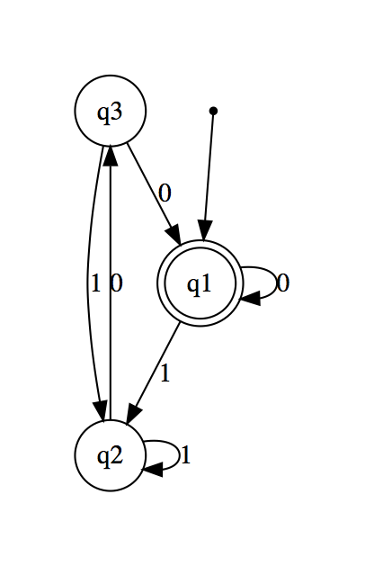
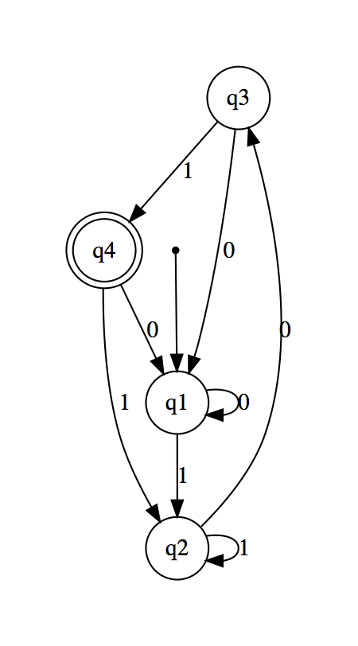

# Arden's Theoreom

Let P and Q be two regular expressions over alphabet

> R = Q ∪ RP

has a unique solution that is:
> R = QP * 

How is this true?  Substitute the value of R into the right-hand side of the original equation:

> R = Q ∪ (Q ∪ RP)P = Q ∪ QP ∪ RP2

then

> R = Q ∪ (Q ∪ (Q ∪ RP)P)P = Q ∪ QP ∪ RP2 ∪ RP3

Do you see the pattern?

> R = Q ∪ QP ∪ RP2 ∪ RP3 ∪ RP4 ...

This pattern is equal to:

> R = QP * .

So this is Arden's Theorem:

> R = Q ∪ RP

is equivalent to

> R = QP * .

# Using Arden's Theorem to find Regular Expressions of a Deterministic Finite Automata

* Assuming the DFA is well-formed
  - There are no empty-string transitions
  - There is one start states
* States q0 to qn
* qi is a final states
* wij denotes the regular expression reprsenting the set of labels of edges from qi to qj.  We can create set of equations, with each equation being the union of the transitions to the state for which we are forming the equation.  For the starting state, the empty string (ϵ) will also be added.  The equations are designed as follows, with q1 being treated as a start state:

q 1  = q1w11 ∪ q2w21 ∪ ... ∪ qnwn1 ∪ ϵ

q 2  = q1w12 ∪ q2w22 ∪ ... ∪ qnwn2

q 3  = q1w13 ∪ q2w23 ∪ ... ∪ qnwn3

## Example

Given the following DFA:

We can use our algorithm to generate the following regular expressions:

q 1  = q2b ∪ q3a ∪ ϵ

q 2  = q1a

q 3  = q1b

q 4  = q2a ∪ q3b ∪ q4a ∪ q4b

Because q1 is the final state, we need to solve for q1 only.  As in a system of equations, we substitute the equations for q2 and q3 into q1, yielding:

q 1  = q1ab ∪ q1ba ∪ ϵ

q 1  = ϵ ∪ q1(ab ∪ ba)

Note:  Do you see the pattern from Arden's Theorem?  Here is Arden's Theorem again:

> R = Q ∪ RP

is equal to

> R = QP * 

Therefore,

q 1  = ϵ ∪ q1(ab ∪ ba)

is equal to:

q 1  = ϵ(ab ∪ ba) * 

q 1  = (ab ∪ ba) * 

## Classroom Exercises

Construct a regular expression corresponding to the the following state diagrams.

1.

2.

# Sources
* *An Introduction to Automata Theory and Formal Language, pp. 102-103*
