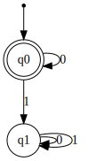
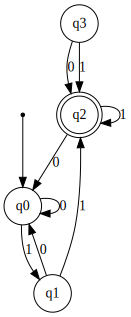

# DFA Minimization

DFAs that are generated from regular expressions or NFAs are not necessarily minimal.

How can we obtain a minimal DFA?

What is a minimal DFA?

**If every state of M is reachable and every pair of states of M is distinguishable, then M is minimal.**

In DFA minimization, it's import to be aware of three kinds of states.

# Dead States


Consider this FA:




As you can see, state q1 is a dead state.

# Inaccessible States

A second type of state is the inaccessible state.  These are states which can never be reached **from the start state**.





# Indistinguishable States
Two states *q1* and *q2* of a DFA are called indistinguishable if:

δ<sup> * </sup> (q1,w) ∈ F ⇒ δ<sup> * </sup>(q2,w) ∈ F

and

δ<sup> * </sup>(q1,w) ∉ F ⇒ δ<sup> * </sup>(q2,w) ∉ F

for all w ∈ Σ <sup>* </sup>

*Note: δ<sup> * </sup> denotes the extended transition function.*

# Distinguishable States
Two states *q1* and *q2* of a DFA are distinguishable if:

 δ<sup> * </sup> (q1,w) ∈ F

and

 δ<sup> * </sup> (q2,w) ∉ F

or vice a versa

for all w ∈ Σ <sup>* </sup>

# Example
Let's consider the following DFA as an example to minimalize.


```python
dftest_1 = DFA(
    states={'q0', 'q1', 'q5', 'q6', 'q2', 'q3', 'q7', 'q4'},
    input_symbols={'a', 'b'},
    transitions={
        'q0': {'b': 'q1', 'a': 'q5'},
        'q1': {'b': 'q6', 'a': 'q2'},
        'q3': {'b': 'q2', 'a': 'q6'},
        'q4': {'b': 'q7', 'a': 'q5'},
        'q5': {'b': 'q2', 'a': 'q6'},
        'q6': {'b': 'q6', 'a': 'q4'},
        'q2': {'b': 'q0', 'a': 'q2'},        
        'q7': {'b': 'q6', 'a': 'q2'}
    },
    initial_state='q0',
    final_states={'q2'}
)

image=generate_dfa_image(dftest_1, "A Non-Minimal DFA")
image
```


# Algorithm for DFA Minimization
1. Remove inaccessible states
2. Draw the transition table for the other states, removing inaccessible states
3. Divide rows of transition table into two tables:
  1. One set contains rows which *start* from *non-final* states
  2. The other set contains only those rows which *start* from *final* states.
4. If any pair of transition in the *non-final* table transits to the same states for each symbol in Σ, then remove one of the states.  If any of the transitions result in that removed state, replace its label with the label of the duplicate that you are keeping.
5. Repeat step 4 on the rest of set 1 until you have eliminated all duplicates.
6. Repeat steps 5 and 6 for the *final* table.
7. Combine the final and non-final tables.

Let's try to apply this algorithm to the DFA above.

Step 1:  First, are there any inaccessible states?

Yes.  q3 is in accessible, so we can remove it.  

> Step 2: Draw the transition table for the other states, removing inaccessible states

So let's draw the transition table.

| δ / Σ | a  | b  |
|-------|----|----|
| -> q0 | q5 | q1 |
| q1    | q2 | q6 |
|*q2    | q2 | q0 |
| q4    | q5 | q7 |
| q5    | q6 | q2 |
| q6    | q4 | q6 |
| q7    | q2 | q6 |


> Step 3. Divide rows of transition table into two tables:
  1. One set contains rows which *start* from *non-final* states
  2. The other set contains only those rows which *start* from *final* states.

### Transitions starting in Non-Final States

| δ / Σ | a  | b  |
|-------|----|----|
| -> q0 | q5 | q1 |
| q1    | q2 | q6 |
| q4    | q5 | q7 |
| q5    | q6 | q2 |
| q6    | q4 | q6 |
| q7    | q2 | q6 |

### Transitions starting in Final States

| δ / Σ | a  | b  |
|-------|----|----|
|*q2    | q2 | q0 |


> Step 4. If any pair of transition in the *non-final* table transits to the same states for each symbol in Σ, then remove one of the states.  If any of the transitions result in that removed state, replace its label with the label of the duplicate that you are keeping.

| δ / Σ | a  | b  |
|-------|----|----|
| -> q0 | q5 | q1 |
| q1    | q2 | q6 |
| q4    | q5 | ~~q7~~ q1 |
| q5    | q6 | q2 |
| q6    | q4 | q6 |
| ~~q7~~    | ~~q2~~ | ~~q6~~ |

> Step 5. Repeat step 4 on the rest of set 1 until you have eliminated all duplicates.

| δ / Σ | a  | b  |
|-------|----|----|
| -> q0 | q5 | q1 |
| q1    | q2 | q6 |
| q4    | q5 | q1 |
| q5    | q6 | q2 |
| q6    | q4 | q6 |

| δ / Σ | a  | b  |
|-------|----|----|
| -> q0 | q5 | q1 |
| q1    | q2 | q6 |
| ~~q4~~    | ~~q5~~ | ~~q1~~ |
| q5    | q6 | q2 |
| q6    | ~~q4~~ q0 | q6 |


This results in a nimimal table for non-final states:

| δ / Σ | a  | b  |
|-------|----|----|
| -> q0 | q5 | q1 |
| q1    | q2 | q6 |
| q5    | q6 | q2 |
| q6    | q0 | q6 |


Now let us examine the table that starts with final states:

| δ / Σ | a  | b  |
|-------|----|----|
|*q2    | q2 | q0 |

It is minimal.

> Step 7. Combine the final and non-final tables.

So if we combine the two minimized states above we get:

| δ / Σ | a  | b  |
|-------|----|----|
| -> q0 | q5 | q1 |
| q1    | q2 | q6 |
| q5    | q6 | q2 |
| q6    | q0 | q6 |
|*q2    | q2 | q0 |

This results in the new minimized DFA:


```python
dftest_1 = DFA(
    states={'q0', 'q1', 'q5', 'q6', 'q2'},
    input_symbols={'a', 'b'},
    transitions={
        'q0': {'b': 'q1', 'a': 'q5'},
        'q1': {'b': 'q6', 'a': 'q2'},
        'q5': {'b': 'q2', 'a': 'q6'},
        'q6': {'b': 'q6', 'a': 'q0'},
        'q2': {'b': 'q0', 'a': 'q2'}        
    },
    initial_state='q0',
    final_states={'q2'}
)

image=generate_dfa_image(dftest_1, "Minimal DFA")
image
```


