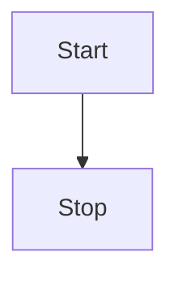

<style>
.container{
    display: flex;
}
.col{
    flex: 1;
}
</style>

# Course Summary

This highly practical course will focus on introducing students to the daily tools of the trade in collaborative software engineering.  Examples include development environments, design tools, virtualization, re-using software packages, source code control, and testing tools.  This course should accelerate students' ability to be productive in software development.

# Course Information

* New course for our degree
* Modeled after MIT's [Missing Semester of your CS Education](https://missing.csail.mit.edu/)
* Highly practical

# Grading 

* Tentative grading plan
* Task-oriented
* Labs based on participation and meeting pre-requisites

# Lecture 1: Editors

# Introduction

* Text-based/command-line editors: vim, emacs, nano

# vi 

* Modal system (command, edit)
* `vi filename.txt` to open/create
* `i` (insert) to switch to edit mode
* Escape to switch to command mode
* `:q` to exit
* `:w` to save
* `:q!` to exit without saving

# Text-based Demos

# VSCode

* Microsoft
* Highly extensible
* Competes with more complete integraded development environments (IDEs)
* Workspaces allow one to quickly load settings and target folders

# VSCode Demos

1. Creating a file
2. Workspaces
3. Managing Extensions

# Markdown

* Why Markdown?
* [Learn the syntax](https://commonmark.org/help/)

# Markdown Demonstration

1. Generating HTML files
2. Code blocks
3. Autoformatting

# Flowcharts

1. Prerequisite [Markdown Preview Enhanced](https://marketplace.visualstudio.com/items?itemName=shd101wyy.markdown-preview-enhanced)
2. [Flowcharts using mermaid-js](https://mermaid-js.github.io/mermaid/#/flowchart)



Place the following in a mermaid code block:
```
graph TD
    Start --> Stop
```

# Coding

# Lab 1 Prerequisites

* Install [VSCode](https://code.visualstudio.com/)
* Install VSCode Python Extension
* Install VSCode's [Markdown Preview Enhanced](https://marketplace.visualstudio.com/items?itemName=shd101wyy.markdown-preview-enhanced) Extension

# Looking ahead

* Below are some some software requirements for future lectures
* Install [VirtualBox](https://www.virtualbox.org/)
* Install [Vagrant](https://www.vagrantup.com/)

# Demos

* [HTML](./html.md)